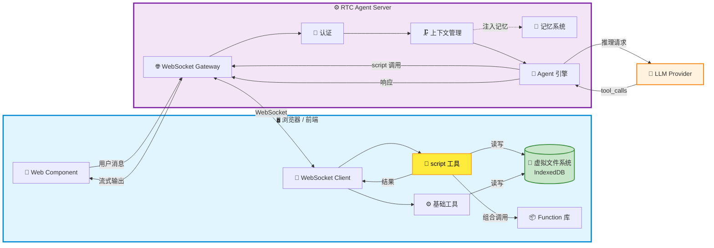
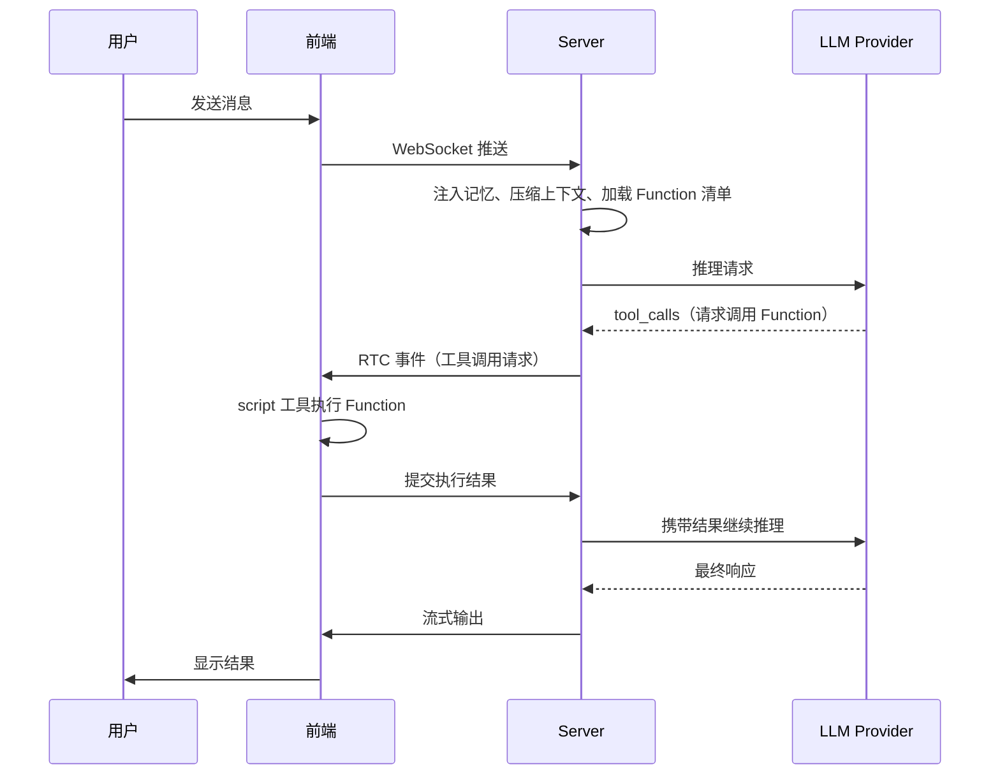

# 🤖 RTC Agent

[English](./README.md) | [中文](./README-ZH.md)

## **Remote Tool Calling — 让你的网站，3 行代码拥有 AI 助手**

不是截图识别，不是 DOM 爬取。AI 通过前端工具直接操作网站，每一步都透明可观测。

---

> **一句话定义**：开源的网站 AI 助手后端，通过标准化的 Remote Tool Calling 协议，让你的网站几行代码接入透明、高效、低成本的 AI 助手。

RTC Agent 让 AI 在服务端推理，**工具在前端执行**——读取页面内容、操作虚拟文件系统、调用业务接口——所有过程通过 WebSocket 实时同步，对你的用户完全可见。

## 🎯 谁应该使用 RTC Agent？

- **SaaS 产品团队**：想为自己的产品添加 AI 助手，但不想重构后端
- **前端开发者**：希望快速集成 AI 能力，专注于业务逻辑而非 AI 基础设施
- **对隐私敏感的应用**：医疗、金融、企业内部工具，数据不能离开用户设备

---

## ✨ 核心能力

### 📂 前端虚拟文件系统

基于 **IndexedDB** 构建，AI 工具（`read` / `write` / `ls` / `grep`）直接操作前端文件，数据不离开用户浏览器。

### 🔑 Script 工具 + Function 组合

开发者**只需维护自己的 Function 库**，Agent 通过 `script` 工具在前端执行，并能**自由组合多个 Function** 完成复杂任务——无需预定义 workflow。

> 💡 **开发者视角**：你只需定义业务原子能力（Function），Agent 自己学会如何组合它们。就像给 AI 一套乐高积木，它自己会拼出你想要的形状。

### 💬 实时通信

基于 **Centrifuge WebSocket**，消息双向推送，支持流式输出、工具调用进度、状态同步。

### 🧠 记忆系统

双层记忆：**Session Memory**（会话上下文压缩）+ **User Memory**（跨会话长期记忆，支持向量检索）。AI 真正"记住"你的用户。

### 🗜️ 上下文管理

自动压缩长对话，Token 消耗可控。告别"上下文超限"报错。

### 🤖 子代理 + 🎯 目标驱动

复杂任务自动拆解，多个专业子代理并行工作；AI 设定、追踪、完成多步骤目标，turn-boundary checkpoint 保证任务不丢失。

---

## 🏗️ 架构

核心数据流：

1. 所有 **Function 和文件数据**都在浏览器的 IndexedDB 中，服务端不接触业务数据
2. Agent 引擎通过 RTC 协议向浏览器发起工具调用，浏览器执行后回传结果
3. 记忆系统和上下文管理在服务端运行，负责对话质量优化

---

## 🔄 工作原理

### 🔑 关键差异

| | 传统方案 | RTC | RTC + Function |
| --- | --------- | ----- | ---------------- |
| **工具执行位置** | 服务端 ❌ | 前端 ✅ | 前端 ✅ |
| **数据流向** | 上云 🔒 | 留在用户设备 🔐 | 留在用户设备 🔐 |
| **扩展方式** | 改服务端代码 | 定义前端工具 | **只需定义 Function，Agent 自己学会组合** |

---

## 📊 对比其他 AI 助手方案

| 方案 | 接入成本 | 可观测性 | Token 成本 | 错误率 | 隐私安全 |
| :----: | :-------: | :-------: | :---------: | :-----: | :-------: |
| **RTC Agent** | 低 — 几行代码 | 完全透明 | 低 | 低 | 数据不出前端 |
| 视觉解析 (截图+OCR) | 中等 | 黑箱 | 极高 | 较高 | 需上传截图 |
| DOM 爬取 (服务端解析) | 复杂 | 部分可见 | 中等 | 中等 | 数据上云 |
| 浏览器插件 | 需安装 | 较好 | 中等 | 中等 | 本地运行 |

> 每种方案都有适用场景：视觉解析适合遗留系统零改造接入，浏览器插件适合离线场景。RTC Agent 的优势在于——**不需要安装、不需要截图、不需要改服务端**，几行代码就能让 AI 以结构化方式理解并操作你的网站。

---

## 🚀 下一步

- [快速开始](https://rtc-agent.github.io/docs/getting-started/) — 5 分钟接入 RTC Agent
- [核心概念](https://rtc-agent.github.io/docs/concepts/) — 深入理解 RTC 协议和虚拟文件系统
- [集成指南](https://rtc-agent.github.io/docs/integration/) — 学习如何注册 Function 和编写 Scenario

---

### 📄 许可证

[MIT License](./LICENSE)

Made with ❤️ by RTC Agent Team
