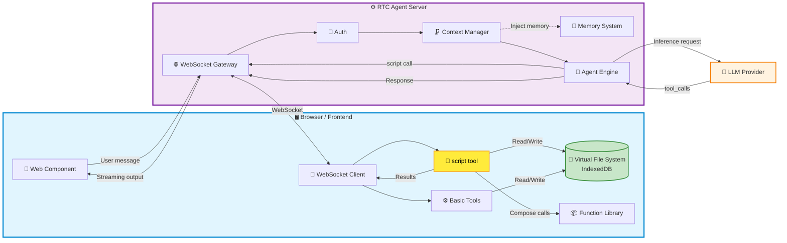
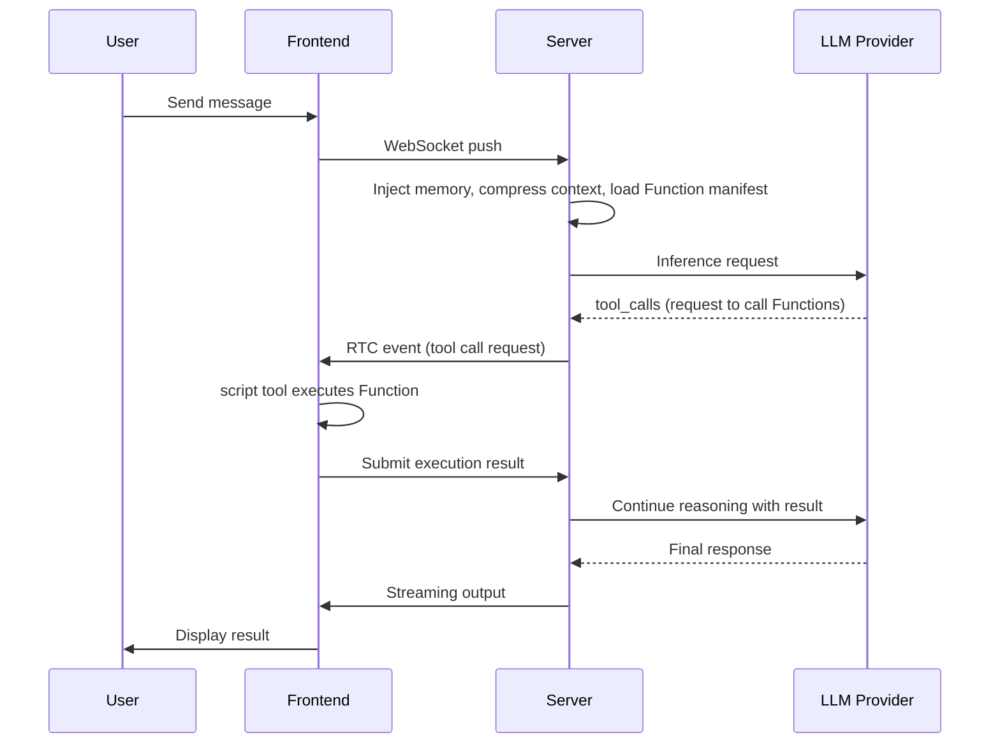

# 🤖 RTC Agent

[English](./README.md) | [中文](./README-ZH.md)

## **Remote Tool Calling — Integrate AI Assistant into Your Website with 3 Lines of Code**

Not screenshot recognition, not DOM crawling. AI operates websites directly through frontend tools — every step transparent and observable.

---

> **One-liner**: An open-source website AI assistant backend. Integrate a transparent, efficient, and cost-effective AI assistant into your website with just a few lines of code via the standardized Remote Tool Calling protocol.

RTC Agent lets AI reason on the server while **tools execute on the frontend** — reading page content, operating a virtual file system, calling business APIs — all synchronized in real-time over WebSocket, fully visible to your users.

## 🎯 Who Should Use RTC Agent?

- **SaaS product teams**: Want to add an AI assistant to their product without restructuring the backend
- **Frontend developers**: Want to quickly integrate AI capabilities, focusing on business logic rather than AI infrastructure
- **Privacy-sensitive applications**: Healthcare, finance, enterprise internal tools — where data cannot leave the user's device

---

## ✨ Core Capabilities

### 📂 Frontend Virtual File System

Built on **IndexedDB**, AI tools (`read` / `write` / `ls` / `grep`) operate directly on frontend files. Data never leaves the user's browser.

### 🔑 Script Tool + Function Composition

Developers **only need to maintain their own Function library**. The Agent executes them on the frontend via the `script` tool and can **freely combine multiple Functions** to accomplish complex tasks — no predefined workflows needed.

> 💡 **Developer's perspective**: You just define your business atomic capabilities (Functions), and the Agent learns how to combine them on its own. It's like giving AI a set of LEGO bricks — it figures out how to build what you want.

### 💬 Real-Time Communication

Built on **Centrifuge WebSocket**, with bidirectional message pushing, supporting streaming output, tool call progress, and state synchronization.

### 🧠 Memory System

Dual-layer memory: **Session Memory** (conversation context compression) + **User Memory** (cross-session long-term memory with vector retrieval). AI truly "remembers" your users.

### 🗜️ Context Management

Automatically compresses long conversations, keeping token consumption under control. Say goodbye to "context length exceeded" errors.

### 🤖 Sub-Agents + 🎯 Goal-Driven Execution

Complex tasks are automatically decomposed, with multiple specialized sub-agents working in parallel. AI sets, tracks, and completes multi-step goals, with turn-boundary checkpoints ensuring no task is lost.

---

## 🏗️ Architecture

Core data flow:

1. All **Function and file data** live in the browser's IndexedDB — the server never touches business data
2. The Agent Engine sends tool calls to the browser via the RTC protocol; the browser executes and returns results
3. Memory and context management run on the server, optimizing conversation quality

---

## 🔄 How It Works

### 🔑 Key Differences

| | Traditional Approach | RTC | RTC + Function |
| --- | --------- | ----- | ---------------- |
| **Tool execution location** | Server-side ❌ | Frontend ✅ | Frontend ✅ |
| **Data flow** | Uploaded to cloud 🔒 | Stays on user device 🔐 | Stays on user device 🔐 |
| **Extension method** | Modify server code | Define frontend tools | **Just define Functions; the Agent learns to compose them** |

---

## 📊 Comparison with Other AI Assistant Solutions

| Solution | Integration Cost | Observability | Token Cost | Error Rate | Privacy & Security |
| :----: | :-------: | :-------: | :---------: | :-----: | :-------: |
| **RTC Agent** | Low — a few lines of code | Fully transparent | Low | Low | Data stays on frontend |
| Visual Parsing (Screenshot + OCR) | Medium | Black box | Very high | Relatively high | Requires uploading screenshots |
| DOM Crawling (Server-side parsing) | Complex | Partially visible | Medium | Medium | Data uploaded to cloud |
| Browser Extension | Requires installation | Good | Medium | Medium | Runs locally |

> Every solution has its place: visual parsing works well for legacy systems with zero modification, and browser extensions suit offline scenarios. RTC Agent's advantage is — **no installation, no screenshots, no server-side changes** — just a few lines of code to let AI understand and operate your website in a structured way.

---

## 🚀 Next Steps

- [Getting Started](https://rtc-agent.github.io/docs/en/getting-started/) — Integrate RTC Agent in 5 minutes
- [Core Concepts](https://rtc-agent.github.io/docs/en/concepts/) — Deep dive into the RTC protocol and virtual file system
- [Integration Guide](https://rtc-agent.github.io/docs/en/integration/) — Learn how to register Functions and write Scenarios

---

### 📄 License

[MIT License](./LICENSE)

Made with ❤️ by RTC Agent Team
