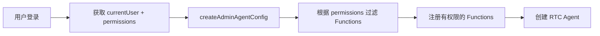
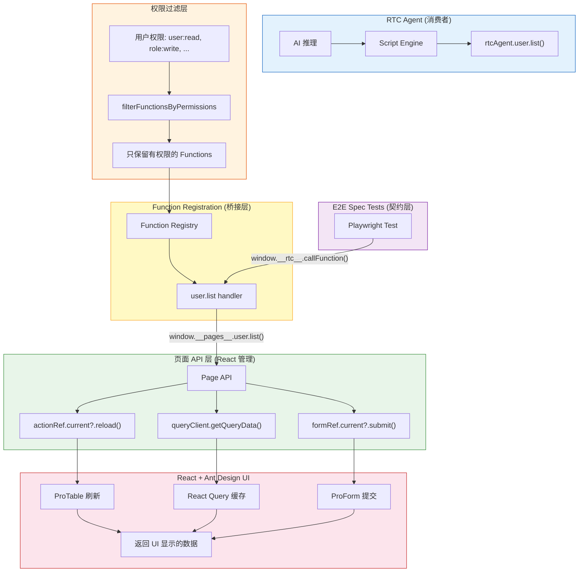
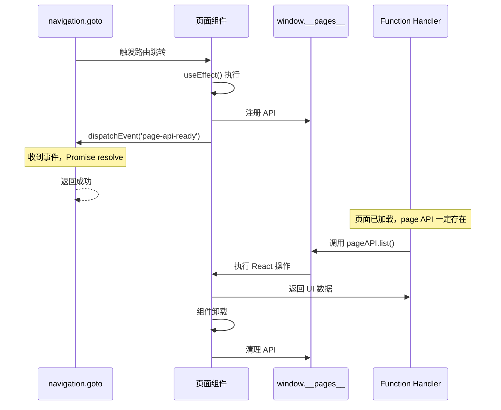
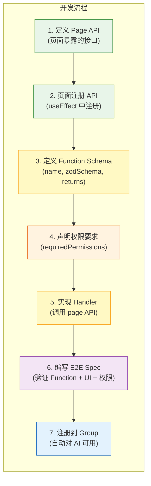

# Function Registration 分层架构设计

## 1. 设计原则

### 原则 1：Function 像人一样操作 UI

Function Handler **调用页面暴露的 React API**，而不是：

- ❌ 直接操作 DOM
- ❌ 绕过 UI 调用后端 API

页面 API 使用 **React 原生方式**（actionRef, formRef, React Query），返回的数据 **= UI 中显示的数据**（Agent 看到的 = 用户看到的）。

### 原则 2：事件驱动的页面就绪机制

使用**事件机制**确保页面加载完毕，不使用 `setTimeout`：

```typescript
// 页面组件注册 API 后发送事件
window.__pages__.rule = pageAPI;
window.dispatchEvent(new CustomEvent('page-api-ready', { detail: { page: 'rule' } }));

// navigation.goto 监听事件，确定性等待
if (!window.__pages__?.[pageName]) {
  await new Promise((resolve) => {
    const handler = (e: CustomEvent) => {
      if (e.detail.page === pageName) {
        window.removeEventListener('page-api-ready', handler);
        resolve(true);
      }
    };
    window.addEventListener('page-api-ready', handler);
  });
}
```

**优势**：

- ✅ 确定性等待（事件触发立即 resolve）
- ✅ 不会超时（不依赖固定时间）
- ✅ 无竞态条件（先检查是否已注册）

### 原则 3：E2E Spec 是契约

先写测试 → 再写实现 → 验证通过 → AI 自然能正确调用。不需要测试 RTC Agent 本身，只需要确保 Functions 的行为 100% 正确。

### 原则 4：权限感知的 Function 注册

Functions 根据用户权限动态注册，**用户只能看到和调用自己有权限的 Functions**：

- ✅ 每个 Function 声明 `requiredPermissions`（需要的权限列表）
- ✅ 注册前根据用户权限过滤，无权 Function 不会注册
- ✅ 无权限要求的 Function（如 navigation、auth）所有用户可用
- ✅ E2E 测试也基于权限验证，模拟不同角色测试

**核心流程**：



## 2. 分层架构总览



**关键原则**：

- ✅ **权限过滤** — 注册前根据用户权限过滤 Functions
- ✅ Handler **不直接操作 DOM**
- ✅ Handler **不绕过 UI 调用后端 API**
- ✅ Handler **调用页面暴露的 React API**
- ✅ 页面 API **使用 React 原生方式**（actionRef, formRef, React Query）
- ✅ 返回的数据 **= UI 中显示的数据**

## 3. 目录结构

```
src/
├── pages/
│   ├── table-list/
│   │   ├── index.tsx                    # 页面组件（注册 page API）
│   │   ├── page-api.ts                  # Page API 定义（供 handler 调用）
│   │   └── components/
│   │       ├── CreateForm.tsx
│   │       └── UpdateForm.tsx
│   │
│   └── system/
│       ├── users/                       # 用户管理页面
│       │   ├── index.tsx
│       │   └── page-api.ts
│       ├── roles/                       # 角色管理页面
│       │   ├── index.tsx
│       │   └── page-api.ts
│       └── permissions/                 # 权限管理页面
│           ├── index.tsx
│           └── page-api.ts
│
├── rtc-agent/
│   ├── index.ts                         # 入口：组装 agentConfig（含权限过滤）
│   ├── types.ts                         # 共享类型
│   ├── permission-filter.ts             # 权限过滤逻辑
│   ├── test-harness.ts                  # 测试桥接（暴露给 Playwright）
│   │
│   ├── groups/
│   │   ├── index.ts                     # 导出所有 groups
│   │   │
│   │   ├── navigation/                  # 页面导航（无权限要求）
│   │   │   ├── index.ts
│   │   │   ├── goto.ts
│   │   │   ├── getCurrentPage.ts
│   │   │   └── listPages.ts
│   │   │
│   │   ├── auth/                        # 认证管理（无权限要求）
│   │   │   ├── index.ts
│   │   │   ├── currentUser.ts
│   │   │   ├── hasPermission.ts
│   │   │   └── logout.ts
│   │   │
│   │   ├── user/                        # 用户管理（需要 user:* 权限）
│   │   │   ├── index.ts
│   │   │   ├── list.ts                  # requiredPermissions: [{ resource: 'user', action: 'read' }]
│   │   │   ├── create.ts               # requiredPermissions: [{ resource: 'user', action: 'write' }]
│   │   │   ├── update.ts               # requiredPermissions: [{ resource: 'user', action: 'write' }]
│   │   │   └── remove.ts               # requiredPermissions: [{ resource: 'user', action: 'delete' }]
│   │   │
│   │   ├── role/                        # 角色管理（需要 role:read/write 权限）
│   │   │   ├── index.ts
│   │   │   ├── list.ts                  # requiredPermissions: [{ resource: 'role', action: 'read' }]
│   │   │   ├── create.ts               # requiredPermissions: [{ resource: 'role', action: 'write' }]
│   │   │   ├── update.ts               # requiredPermissions: [{ resource: 'role', action: 'write' }]
│   │   │   └── remove.ts               # requiredPermissions: [{ resource: 'role', action: 'write' }]
│   │   │
│   │   ├── permission/                  # 权限管理（需要 permission:read/write 权限）
│   │   │   ├── index.ts
│   │   │   ├── list.ts                  # requiredPermissions: [{ resource: 'permission', action: 'read' }]
│   │   │   ├── create.ts               # requiredPermissions: [{ resource: 'permission', action: 'write' }]
│   │   │   ├── update.ts               # requiredPermissions: [{ resource: 'permission', action: 'write' }]
│   │   │   └── remove.ts               # requiredPermissions: [{ resource: 'permission', action: 'write' }]
│   │   │
│   │   ├── userRole/                    # 用户角色分配（需要 user_role:read/write 权限）
│   │   │   ├── index.ts
│   │   │   ├── list.ts                  # requiredPermissions: [{ resource: 'user_role', action: 'read' }]
│   │   │   ├── assign.ts               # requiredPermissions: [{ resource: 'user_role', action: 'write' }]
│   │   │   └── revoke.ts               # requiredPermissions: [{ resource: 'user_role', action: 'write' }]
│   │   │
│   │   └── auditLog/                    # 审计日志（需要 audit_log:read 权限）
│   │       ├── index.ts
│   │       └── list.ts                  # requiredPermissions: [{ resource: 'audit_log', action: 'read' }]
│   │
│   └── e2e/                             # Playwright E2E 测试
│       ├── fixtures/
│       │   └── rtc-functions.ts        # 自定义 fixture：暴露 function 调用（含权限模拟）
│       └── specs/
│           ├── navigation.spec.ts
│           ├── auth.spec.ts
│           ├── user.spec.ts             # 测试 user:* 权限的 functions
│           ├── role.spec.ts
│           └── permission-filter.spec.ts # 测试权限过滤逻辑
```

## 4. 代码示例

### 4.1 Page API 定义 (`src/pages/table-list/page-api.ts`)

```typescript
/**
 * TableList 页面的 API 接口
 *
 * 页面组件在挂载时注册这些 API 到 window.__pages__
 * Function handler 通过调用这些 API 来操作 UI
 *
 * 关键原则：
 * - 使用 React 原生方式（actionRef, React Query）
 * - 返回 UI 中显示的数据
 * - 不直接操作 DOM
 */

import type { ActionType } from '@ant-design/pro-components';
import type { QueryClient } from '@tanstack/react-query';

export interface RulePageAPI {
  /**
   * 读取表格当前显示的数据
   * 从 React Query 缓存中获取，与 UI 显示一致
   */
  list: (params?: { current?: number; pageSize?: number }) => Promise<{
    success: boolean;
    data: Array<{
      key: number;
      name: string;
      desc: string;
      callNo: number;
      status: number;
      updatedAt: string;
    }>;
    total: number;
  }>;

  /**
   * 刷新表格
   * 调用 actionRef.current?.reload()
   */
  refresh: () => Promise<void>;

  /**
   * 创建规则
   * 触发创建流程（打开弹窗、填充表单、提交）
   */
  create: (data: { name: string; desc: string }) => Promise<{ success: boolean; id?: number }>;

  /**
   * 更新规则
   * 触发更新流程（打开弹窗、填充数据、提交）
   */
  update: (data: { key: number; name?: string; desc?: string }) => Promise<{ success: boolean }>;

  /**
   * 删除规则
   * 调用 React Query mutation
   */
  remove: (keys: number[]) => Promise<{ success: boolean }>;
}

// 全局类型声明
declare global {
  interface Window {
    __pages__?: {
      rule?: RulePageAPI;
    };
  }
}
```

### 4.2 页面组件注册 API (`src/pages/table-list/index.tsx`)

```typescript
import type { ActionType } from '@ant-design/pro-components';
import { useMutation, useQueryClient } from '@tanstack/react-query';
import React, { useEffect, useRef } from 'react';
import type { RulePageAPI } from './page-api';

const TableList: React.FC = () => {
  const actionRef = useRef<ActionType | null>(null);
  const queryClient = useQueryClient();

  // === React Query Mutations（不直接 fetch 后端） ===
  const createMutation = useMutation({
    mutationFn: (data: { name: string; desc: string }) =>
      fetch('/api/rule', {
        method: 'POST',
        headers: { 'Content-Type': 'application/json' },
        body: JSON.stringify(data),
      }).then((r) => r.json()),
    onSuccess: () => {
      actionRef.current?.reload();
      queryClient.invalidateQueries({ queryKey: ['rule'] });
    },
  });

  const removeMutation = useMutation({
    mutationFn: (keys: number[]) =>
      fetch('/api/removeRule', {
        method: 'POST',
        headers: { 'Content-Type': 'application/json' },
        body: JSON.stringify({ key: keys }),
      }).then((r) => r.json()),
    onSuccess: () => {
      actionRef.current?.reload();
      queryClient.invalidateQueries({ queryKey: ['rule'] });
    },
  });

  // === 注册 Page API ===
  useEffect(() => {
    const pageAPI: RulePageAPI = {
      // 读取表格数据（从 React Query 缓存）
      list: async (params = {}) => {
        const { current = 1, pageSize = 20 } = params;

        // 从 React Query 缓存获取数据
        const cachedData = queryClient.getQueryData(['rule', { current, pageSize }]);

        if (cachedData && typeof cachedData === 'object' && 'data' in cachedData) {
          return {
            success: true,
            data: cachedData.data || [],
            total: cachedData.total || 0,
          };
        }

        // 如果缓存中没有，触发刷新并等待 actionRef 加载
        // 不使用 setTimeout，而是等待 ProTable 的 request 完成
        return new Promise((resolve) => {
          const checkData = () => {
            const data = queryClient.getQueryData(['rule', { current, pageSize }]);
            if (data) {
              resolve({
                success: true,
                data: (data as any).data || [],
                total: (data as any).total || 0,
              });
            } else {
              // 等待 React Query 完成（通过订阅 queryClient）
              const unsubscribe = queryClient.getQueryCache().subscribe((event) => {
                if (event?.query.queryKey[0] === 'rule') {
                  unsubscribe();
                  resolve({
                    success: true,
                    data: (event.query.state.data as any)?.data || [],
                    total: (event.query.state.data as any)?.total || 0,
                  });
                }
              });
              actionRef.current?.reload();
            }
          };
          checkData();
        });
      },

      // 刷新表格
      refresh: async () => {
        actionRef.current?.reload();
      },

      // 创建规则（通过 React Query mutation，不直接 fetch）
      create: async (data) => {
        const result = await createMutation.mutateAsync(data);
        return { success: result.success, id: result.data?.key };
      },

      // 更新规则
      update: async (data) => {
        const response = await fetch('/api/rule', {
          method: 'PUT',
          headers: { 'Content-Type': 'application/json' },
          body: JSON.stringify(data),
        });
        const result = await response.json();
        actionRef.current?.reload();
        queryClient.invalidateQueries({ queryKey: ['rule'] });
        return { success: result.success };
      },

      // 删除规则（通过 React Query mutation）
      remove: async (keys) => {
        const result = await removeMutation.mutateAsync(keys);
        return { success: result.success };
      },
    };

    // 注册到全局
    window.__pages__ = window.__pages__ || {};
    window.__pages__.rule = pageAPI;

    // 发送就绪事件（通知 navigation.goto 页面已加载）
    window.dispatchEvent(
      new CustomEvent('page-api-ready', { detail: { page: 'rule' } })
    );

    console.log('[TableList] Page API registered');

    // 清理
    return () => {
      delete window.__pages__?.rule;
      console.log('[TableList] Page API unregistered');
    };
  }, [queryClient]);

  // ... 原有的 ProTable 代码 ...

  return (
    <PageContainer>
      <ProTable<API.RuleListItem, API.PageParams>
        actionRef={actionRef}
        request={rule}
        // ... 其他配置
      />
    </PageContainer>
  );
};

export default TableList;
```

### 4.3 Function Handler (`src/rtc-agent/groups/rule/list.ts`)

```typescript
import { z, withMeta } from '@rtc-agent/component';
import type { FunctionDef } from '@rtc-agent/component';

/**
 * 查询规则列表
 *
 * 对应页面：/list/table-list
 *
 * 实现方式：
 * - 调用页面暴露的 React API（window.__pages__.rule.list）
 * - 页面 API 从 React Query 缓存读取数据
 * - 返回的数据 = UI 表格中显示的数据
 *
 * 前提：navigation.goto 已确保页面加载完毕，page API 已注册
 */
export const listRule: FunctionDef = {
  name: 'list',
  description: '查询规则列表，返回当前表格中显示的数据',

  zodSchema: z.object({
    current: withMeta(z.number().int().positive(), { example: 1 })
      .optional()
      .describe('当前页码，默认 1'),
    pageSize: withMeta(z.number().int().positive(), { example: 20 })
      .optional()
      .describe('每页条数，默认 20'),
  }),

  returns: {
    zodSchema: z.object({
      success: z.boolean().describe('是否成功'),
      data: z.array(z.object({
        key: z.number().describe('规则 ID'),
        name: z.string().describe('规则名称'),
        desc: z.string().describe('描述'),
        callNo: z.number().describe('调用次数'),
        status: z.number().describe('状态：0-关闭 1-运行中 2-已上线 3-异常'),
        updatedAt: z.string().describe('更新时间'),
      })).describe('规则列表（与 UI 表格显示一致）'),
      total: z.number().describe('总数'),
    }).describe('规则列表查询结果'),
  },

  handler: async (params) => {
    const { current = 1, pageSize = 20 } = params as {
      current?: number;
      pageSize?: number;
    };

    // 页面已加载，直接调用 API
    return await window.__pages__.rule.list({ current, pageSize });
  },

  hooks: {
    onStart: () => {
      console.log('[rule.list] 读取规则列表...');
    },
    onSuccess: (result) => {
      console.log(`[rule.list] 读取成功，共 ${(result as any).total} 条`);
    },
    onError: (error) => {
      console.error('[rule.list] 读取失败:', error.message);
    },
  },
};
```

### 4.4 Function Handler - 创建规则 (`src/rtc-agent/groups/rule/create.ts`)

```typescript
import { z, withMeta } from '@rtc-agent/component';
import type { FunctionDef } from '@rtc-agent/component';

/**
 * 创建规则
 *
 * 实现方式：
 * - 调用页面 API 触发创建流程
 * - 页面 API 内部使用 React 方式操作（actionRef, mutation）
 * - 创建成功后自动刷新表格
 */
export const createRule: FunctionDef = {
  name: 'create',
  description: '创建新规则，创建成功后表格会自动刷新',

  zodSchema: z.object({
    name: withMeta(z.string(), { example: '新规则' })
      .describe('规则名称'),
    desc: withMeta(z.string(), { example: '规则描述' })
      .describe('规则描述'),
  }),

  returns: {
    zodSchema: z.object({
      success: z.boolean().describe('是否成功'),
      id: z.number().optional().describe('新创建的规则 ID'),
    }).describe('创建结果'),
  },

  handler: async (params) => {
    const { name, desc } = params as { name: string; desc: string };

    // 页面已加载，直接调用 API
    return await window.__pages__.rule.create({ name, desc });
  },
};
```

### 4.5 Group 定义 (`src/rtc-agent/groups/rule/index.ts`)

```typescript
import type { AgentFunctionGroup } from '@rtc-agent/component';
import { listRule } from './list';
import { createRule } from './create';
import { updateRule } from './update';
import { removeRule } from './remove';

/**
 * 规则管理 Function Group
 *
 * 对应页面路由：/list/table-list
 *
 * 所有 function 都调用页面暴露的 React API：
 * - window.__pages__.rule.list()
 * - window.__pages__.rule.create()
 * - window.__pages__.rule.update()
 * - window.__pages__.rule.remove()
 */
export const ruleGroup: AgentFunctionGroup = {
  name: 'rule',
  description: '规则管理模块，支持规则的增删改查操作。所有操作都会反映在 UI 表格中。',
  functions: [
    listRule,
    createRule,
    updateRule,
    removeRule,
  ],
};
```

### 4.6 入口组装（含权限过滤）(`src/rtc-agent/index.ts`)

```typescript
import type { AgentConfig } from '@rtc-agent/component';
import { filterGroupsByPermissions } from './permission-filter';
import type { Permission } from './permission-filter';

// 导入所有 Function Groups
import { navigationGroup } from './groups/navigation';
import { authGroup } from './groups/auth';
import { ruleGroup } from './groups/rule';
import { userGroup } from './groups/user';
import { roleGroup } from './groups/role';
import { permissionGroup } from './groups/permission';
import { userRoleGroup } from './groups/userRole';
import { auditLogGroup } from './groups/auditLog';

/**
 * 所有 Function Groups（未过滤）
 *
 * - navigation/auth: 无权限要求，所有用户可用
 * - rule: 示例页面，不受 RBAC 控制
 * - user/role/permission/userRole/auditLog: 受 RBAC 权限控制
 */
const allGroups = [
  navigationGroup,   // 无权限要求
  authGroup,         // 无权限要求
  ruleGroup,         // 示例页面，无权限要求
  userGroup,         // 需要 user:* 权限
  roleGroup,         // 需要 role:* 权限
  permissionGroup,   // 需要 permission:* 权限
  userRoleGroup,     // 需要 user_role:* 权限
  auditLogGroup,     // 需要 audit_log:read 权限
];

/**
 * 创建 admin-ui 的 AgentConfig（根据用户权限过滤 Function Groups）
 *
 * @param userPermissions - 当前用户的权限列表（来自 /api/auth/me）
 *
 * 示例：
 * - admin 用户（所有权限）→ 注册所有 Function Groups
 * - operator 用户（user:read, user:write, role:read）→ 只注册 user 的部分 Functions + role.list
 * - viewer 用户（user:read）→ 只注册 user.list + navigation + auth + rule
 */
export function createAdminAgentConfig(
  userPermissions: Permission[] = []
): Partial<AgentConfig> {
  // 根据用户权限过滤 Function Groups
  const filteredGroups = filterGroupsByPermissions(allGroups, userPermissions);

  // 输出过滤结果（开发环境）
  if (process.env.NODE_ENV === 'development') {
    console.log('[AdminAgentConfig] User permissions:', userPermissions);
    console.log('[AdminAgentConfig] Filtered groups:',
      filteredGroups.map((g) => `${g.name}(${g.functions.length} functions)`)
    );
  }

  return {
    name: 'AdminUI',
    description: 'Ant Design Pro 后台管理系统',
    persona: `你是一个后台管理系统的 AI 助手。
你可以帮助用户：
- 导航到不同的页面
- 查看当前用户信息和权限
- 管理用户、角色、权限（根据用户权限）

请始终使用已注册的 Function 来执行操作。
如果某个 Function 不存在，说明用户没有相应权限。`,

    groups: filteredGroups,
  };
}

/**
 * 导出所有 Function Groups（供测试使用）
 */
export { allGroups };
```

### 4.7 测试桥接 (`src/rtc-agent/test-harness.ts`)

```typescript
import { allGroups } from './index';

/**
 * 测试桥接模块
 *
 * 在开发/测试环境下，将 Function Registry 暴露到 window 对象
 * 供 Playwright E2E 测试直接调用
 *
 * 用法（在 Playwright 中）：
 *   const result = await page.evaluate(() => {
 *     return window.__rtc__.callFunction('rule.list', { current: 1 });
 *   });
 */

interface RtcTestHarness {
  /**
   * 调用指定 Function
   * @param fullPath - 完整路径，如 'rule.list'
   * @param params - 函数参数
   */
  callFunction: (fullPath: string, params?: Record<string, unknown>) => Promise<unknown>;

  /**
   * 列出所有可用的 Functions
   */
  listFunctions: () => Array<{ group: string; name: string; description: string }>;
}

// 构建 function map
function buildFunctionMap(): Map<string, (params?: Record<string, unknown>) => Promise<unknown>> {
  const map = new Map();

  for (const group of allGroups) {
    for (const fn of group.functions) {
      const fullPath = `${group.name}.${fn.name}`;
      map.set(fullPath, async (params?: Record<string, unknown>) => {
        return fn.handler(params || {}, () => {});
      });
    }
  }

  return map;
}

/**
 * 初始化测试桥接
 * 仅在开发环境或测试环境生效
 */
export function initTestHarness(): void {
  // 安全检查：仅在非生产环境暴露
  if (process.env.NODE_ENV === 'production') {
    return;
  }

  const functionMap = buildFunctionMap();

  const harness: RtcTestHarness = {
    callFunction: async (fullPath, params) => {
      const fn = functionMap.get(fullPath);
      if (!fn) {
        throw new Error(`Function not found: ${fullPath}`);
      }
      return fn(params);
    },

    listFunctions: () => {
      const result: Array<{ group: string; name: string; description: string }> = [];
      for (const group of allGroups) {
        for (const fn of group.functions) {
          result.push({
            group: group.name,
            name: fn.name,
            description: fn.description,
          });
        }
      }
      return result;
    },
  };

  // 暴露到 window
  (window as any).__rtc__ = harness;

  console.log('[RTC Test Harness] Initialized. Use window.__rtc__ to call functions.');
}
```

### 4.8 Navigation Group 示例

导航函数使用**事件机制**确保页面加载完毕后才返回：

```typescript
// src/rtc-agent/groups/navigation/goto.ts
import { z, withMeta } from '@rtc-agent/component';
import type { FunctionDef } from '@rtc-agent/component';

export const goto: FunctionDef = {
  name: 'goto',
  description: '导航到指定页面，等待页面加载完毕（page API 注册完成）后返回',

  zodSchema: z.object({
    path: withMeta(z.string(), { example: '/list/table-list' })
      .describe('目标页面路径'),
  }),

  returns: {
    zodSchema: z.object({
      success: z.boolean().describe('是否成功'),
      path: z.string().describe('当前页面路径'),
      title: z.string().describe('页面标题'),
    }).describe('导航结果'),
  },

  handler: async (params) => {
    const { path } = params as { path: string };

    // 提取页面名称（从路径推断 page API 的 key）
    const pageName = extractPageName(path); // '/list/table-list' -> 'rule'

    // 1. 导航到新页面
    window.history.pushState({}, '', path);
    window.dispatchEvent(new PopStateEvent('popstate'));

    // 2. 等待页面 API 注册完成（确定性等待，不使用 setTimeout）
    if (!window.__pages__?.[pageName]) {
      await new Promise<void>((resolve) => {
        const handler = (e: Event) => {
          const customEvent = e as CustomEvent<{ page: string }>;
          if (customEvent.detail.page === pageName) {
            window.removeEventListener('page-api-ready', handler);
            resolve();
          }
        };
        window.addEventListener('page-api-ready', handler);
      });
    }

    // 3. 此时 page API 已注册，后续 Function 可以直接调用

    return {
      success: true,
      path: window.location.pathname,
      title: document.title,
    };
  },
};

// 辅助函数：从路径提取页面名称
function extractPageName(path: string): string {
  const mapping: Record<string, string> = {
    '/list/table-list': 'rule',
    '/dashboard/analysis': 'dashboard',
    // ... 其他映射
  };
  return mapping[path] || path.split('/').pop() || '';
}
```

**页面组件注册时发送事件**：

```typescript
// src/pages/table-list/index.tsx
useEffect(() => {
  const pageAPI: RulePageAPI = { /* ... */ };
  
  // 注册 API
  window.__pages__ = window.__pages__ || {};
  window.__pages__.rule = pageAPI;

  // 发送就绪事件（通知 navigation.goto）
  window.dispatchEvent(
    new CustomEvent('page-api-ready', { detail: { page: 'rule' } })
  );

  return () => {
    delete window.__pages__?.rule;
  };
}, []);
```

**使用示例**：

```typescript
// AI 调用示例
await rtcAgent.navigation.goto({ path: '/list/table-list' });
// ✅ 事件机制确保 page API 已注册

await rtcAgent.rule.list({ current: 1 });
// ✅ 直接调用，无需等待
```

### 4.9 E2E 测试 (`src/rtc-agent/e2e/specs/rule.spec.ts`)

```typescript
import { expect, test } from '../fixtures/rtc-functions';

test.describe('rule Group - 规则管理', () => {
  test.beforeEach(async ({ page, login }) => {
    // 登录并导航到规则列表页
    await login();
    await page.goto('/list/table-list');
    await page.waitForLoadState('networkidle');
  });

  test('rule.list - 读取表格数据（与 UI 一致）', async ({ page, callFunction }) => {
    // 调用 function
    const result = await callFunction('rule.list', {
      current: 1,
      pageSize: 10,
    });

    // 验证返回值结构
    expect(result).toHaveProperty('success', true);
    expect(result).toHaveProperty('data');
    expect(result).toHaveProperty('total');

    // 验证数据与 UI 表格一致
    const tableRows = await page.locator('.ant-table-tbody tr').count();
    const resultData = (result as any).data;
    expect(resultData.length).toBe(tableRows);

    // 验证第一行数据
    if (resultData.length > 0) {
      const firstRowName = await page.locator('.ant-table-tbody tr:first-child td:nth-child(2)').textContent();
      expect(resultData[0].name).toBe(firstRowName?.trim());
    }
  });

  test('rule.create - 创建规则并刷新表格', async ({ page, callFunction }) => {
    // 记录创建前的行数
    const rowsBefore = await page.locator('.ant-table-tbody tr').count();

    // 调用 function
    const result = await callFunction('rule.create', {
      name: '测试规则',
      desc: 'E2E 测试创建的规则',
    });

    expect(result).toHaveProperty('success', true);

    // 验证表格已刷新（行数增加）
    await page.waitForTimeout(500); // 等待刷新完成
    const rowsAfter = await page.locator('.ant-table-tbody tr').count();
    expect(rowsAfter).toBe(rowsBefore + 1);

    // 验证新规则出现在表格中
    const newRuleVisible = await page.locator(`text=测试规则`).isVisible();
    expect(newRuleVisible).toBe(true);
  });

  test('rule.remove - 删除规则并刷新表格', async ({ page, callFunction }) => {
    // 先创建一条规则
    await callFunction('rule.create', {
      name: '待删除规则',
      desc: '即将被删除',
    });

    // 记录当前行数
    const rowsBefore = await page.locator('.ant-table-tbody tr').count();

    // 找到刚创建的规则
    const targetRow = await page.locator('tr', { hasText: '待删除规则' });
    const keyCell = await targetRow.locator('td:first-child').textContent();
    const ruleKey = parseInt(keyCell || '0');

    // 调用 function 删除
    const result = await callFunction('rule.remove', {
      keys: [ruleKey],
    });

    expect(result).toHaveProperty('success', true);

    // 验证表格已刷新（行数减少）
    await page.waitForTimeout(500);
    const rowsAfter = await page.locator('.ant-table-tbody tr').count();
    expect(rowsAfter).toBe(rowsBefore - 1);

    // 验证规则已从表格消失
    const ruleStillVisible = await page.locator(`text=待删除规则`).isVisible();
    expect(ruleStillVisible).toBe(false);
  });
});
```

### 4.10 Playwright Fixture (`src/rtc-agent/e2e/fixtures/rtc-functions.ts`)

```typescript
import { test as base } from '@playwright/test';
import type { Permission } from '@/rtc-agent/permission-filter';

type RtcFunctionsFixtures = {
  /** 调用 RTC Function */
  callFunction: (fullPath: string, params?: Record<string, unknown>) => Promise<unknown>;
  /** 登录 helper（默认 admin 角色） */
  login: () => Promise<void>;
  /** 以指定角色登录 */
  loginAs: (role: 'admin' | 'operator' | 'viewer') => Promise<void>;
  /** 列出所有已注册的 Functions */
  listFunctions: () => Promise<Array<{ group: string; name: string; description: string }>>;
};

// 角色对应的权限映射（与后端一致）
const ROLE_PERMISSIONS: Record<string, Permission[]> = {
  admin: [
    { resource: 'user', action: 'read' },
    { resource: 'user', action: 'write' },
    { resource: 'user', action: 'delete' },
    { resource: 'role', action: 'read' },
    { resource: 'role', action: 'write' },
    { resource: 'role', action: 'delete' },
    { resource: 'permission', action: 'read' },
    { resource: 'permission', action: 'write' },
    { resource: 'permission', action: 'delete' },
    { resource: 'user_role', action: 'read' },
    { resource: 'user_role', action: 'write' },
    { resource: 'user_role', action: 'delete' },
    { resource: 'audit_log', action: 'read' },
  ],
  operator: [
    { resource: 'user', action: 'read' },
    { resource: 'user', action: 'write' },
    { resource: 'role', action: 'read' },
  ],
  viewer: [
    { resource: 'user', action: 'read' },
  ],
};

export const test = base.extend<RtcFunctionsFixtures>({
  callFunction: async ({ page }, use) => {
    const callFunction = async (fullPath: string, params?: Record<string, unknown>) => {
      return page.evaluate(
        ({ path, args }) => {
          // @ts-ignore
          return window.__rtc__?.callFunction(path, args);
        },
        { path: fullPath, args: params }
      );
    };
    await use(callFunction);
  },

  login: async ({ page }, use) => {
    const login = async () => {
      await page.goto('/user/login');
      await page.fill('input[name="email"]', 'admin');
      await page.fill('input[name="password"]', 'ant.design');
      await page.click('button[type="submit"]');
      await page.waitForURL('**/dashboard/**');
    };
    await use(login);
  },

  // === 新增：以指定角色登录 ===
  loginAs: async ({ page }, use) => {
    const loginAs = async (role: 'admin' | 'operator' | 'viewer') => {
      // Mock /api/auth/me 接口返回对应角色的权限
      await page.route('**/api/auth/me', async (route) => {
        await route.fulfill({
          status: 200,
          contentType: 'application/json',
          body: JSON.stringify({
            success: true,
            data: {
              id: 'test-user-id',
              email: `${role}@example.com`,
              name: role.toUpperCase(),
              roles: [{ id: 'role-id', name: role, display_name: role }],
              permissions: ROLE_PERMISSIONS[role],
            },
          }),
        });
      });

      await page.goto('/user/login');
      await page.fill('input[name="email"]', role);
      await page.fill('input[name="password"]', 'ant.design');
      await page.click('button[type="submit"]');
      await page.waitForURL('**/dashboard/**');

      // 等待 RTC Agent 初始化完成（带权限过滤）
      await page.waitForFunction(() => {
        // @ts-ignore
        return window.__rtc__?.listFunctions !== undefined;
      });
    };
    await use(loginAs);
  },

  // === 新增：列出已注册的 Functions ===
  listFunctions: async ({ page }, use) => {
    const listFunctions = async () => {
      return page.evaluate(() => {
        // @ts-ignore
        return window.__rtc__?.listFunctions() || [];
      });
    };
    await use(listFunctions);
  },
});

export { expect } from '@playwright/test';
```

### 4.10.1 权限过滤 E2E 测试 (`src/rtc-agent/e2e/specs/permission-filter.spec.ts`)

```typescript
import { expect, test } from '../fixtures/rtc-functions';

test.describe('权限过滤 - Functions 根据角色权限动态注册', () => {
  test('admin 角色 - 所有 Functions 可用', async ({ loginAs, listFunctions }) => {
    await loginAs('admin');

    const functions = await listFunctions();

    // admin 应该能看到所有 groups
    const groupNames = [...new Set(functions.map((f) => f.group))];
    expect(groupNames).toContain('navigation');
    expect(groupNames).toContain('auth');
    expect(groupNames).toContain('user');
    expect(groupNames).toContain('role');
    expect(groupNames).toContain('permission');
    expect(groupNames).toContain('userRole');
    expect(groupNames).toContain('auditLog');

    // user group 应该有完整的 CRUD
    const userFunctions = functions.filter((f) => f.group === 'user');
    expect(userFunctions.map((f) => f.name)).toEqual(
      expect.arrayContaining(['list', 'create', 'update', 'remove'])
    );
  });

  test('operator 角色 - 只有部分 Functions 可用', async ({ loginAs, listFunctions }) => {
    await loginAs('operator');

    const functions = await listFunctions();
    const groupNames = [...new Set(functions.map((f) => f.group))];

    // operator 有 user:read, user:write, role:read
    expect(groupNames).toContain('navigation');
    expect(groupNames).toContain('auth');
    expect(groupNames).toContain('user');
    expect(groupNames).toContain('role'); // role:read

    // operator 没有 permission, user_role, audit_log 权限
    expect(groupNames).not.toContain('permission');
    expect(groupNames).not.toContain('userRole');
    expect(groupNames).not.toContain('auditLog');

    // user group 只有 list, create, update（没有 delete）
    const userFunctions = functions.filter((f) => f.group === 'user');
    expect(userFunctions.map((f) => f.name)).toEqual(
      expect.arrayContaining(['list', 'create', 'update'])
    );
    expect(userFunctions.map((f) => f.name)).not.toContain('remove');

    // role group 只有 list（没有 create, update, remove）
    const roleFunctions = functions.filter((f) => f.group === 'role');
    expect(roleFunctions.map((f) => f.name)).toEqual(['list']);
  });

  test('viewer 角色 - 只有只读 Functions 可用', async ({ loginAs, listFunctions }) => {
    await loginAs('viewer');

    const functions = await listFunctions();
    const groupNames = [...new Set(functions.map((f) => f.group))];

    // viewer 只有 user:read
    expect(groupNames).toContain('navigation');
    expect(groupNames).toContain('auth');
    expect(groupNames).toContain('user');

    // viewer 没有其他权限
    expect(groupNames).not.toContain('role');
    expect(groupNames).not.toContain('permission');
    expect(groupNames).not.toContain('userRole');
    expect(groupNames).not.toContain('auditLog');

    // user group 只有 list
    const userFunctions = functions.filter((f) => f.group === 'user');
    expect(userFunctions.map((f) => f.name)).toEqual(['list']);
  });

  test('无权限的 Function 调用应该失败', async ({ loginAs, callFunction }) => {
    await loginAs('viewer'); // 只有 user:read

    // viewer 可以尝试调用 user.list（有权限）
    const listResult = await callFunction('user.list', {});
    expect(listResult).toBeDefined();

    // viewer 尝试调用 user.remove（没有权限，function 不存在）
    // 应该抛出错误，因为 function 没有被注册
    await expect(
      callFunction('user.remove', { ids: ['test-id'] })
    ).rejects.toThrow(/Function not found/);
  });
});
```

### 4.11 权限过滤机制 (`src/rtc-agent/permission-filter.ts`)

> **重要说明**：`requiredPermissions` 是 **admin-ui 自定义的扩展属性**，不是 `@rtc-agent/component` 原生支持的字段。`@rtc-agent/component` 的 `FunctionDef` 类型不包含此属性。admin-ui 通过定义 `PermissionAwareFunctionDef` 接口来扩展 `FunctionDef`，在注册前通过 `filterGroupsByPermissions` 过滤掉无权 Function，然后将过滤后的 Function 传给 `@rtc-agent/component`。

**边界情况**：

- **Group 内部分 Function 有权限**：过滤后 Group 仍然存在，只包含有权限的 Function。例如用户有 `user:read` 但没有 `user:delete`，则 `user` Group 只保留 `list` Function。
- **Group 内所有 Function 无权限**：整个 Group 被移除，AI 完全看不到该 Group 的存在。
- **权限过滤是一次性的**：在 `createAdminAgentConfig()` 初始化时过滤，之后权限变更需要重新挂载 RTC Agent（刷新页面）。

```typescript
/**
 * 权限过滤模块
 *
 * 根据用户权限过滤 Functions，只注册用户有权限使用的 Functions
 */

/**
 * 权限定义（与后端 API 返回一致）
 */
export interface Permission {
  resource: string;
  action: string;
}

/**
 * 带权限要求的 Function 定义
 *
 * 扩展 FunctionDef，添加 requiredPermissions 属性
 */
export interface PermissionAwareFunctionDef {
  name: string;
  description: string;
  /** 需要的权限列表，为空表示无权限要求（所有用户可用） */
  requiredPermissions?: Permission[];
  // ... 其他 FunctionDef 属性
}

/**
 * 将权限数组转换为 Set<string>，用于 O(1) 查询
 */
export function buildPermissionSet(permissions: Permission[]): Set<string> {
  return new Set(permissions.map((p) => `${p.resource}:${p.action}`));
}

/**
 * 检查用户是否拥有 Function 所需的所有权限
 */
export function hasRequiredPermissions(
  fn: PermissionAwareFunctionDef,
  userPermissionSet: Set<string>,
): boolean {
  // 无权限要求 = 所有用户可用
  if (!fn.requiredPermissions || fn.requiredPermissions.length === 0) {
    return true;
  }

  // 检查用户是否拥有所有需要的权限
  return fn.requiredPermissions.every((p) =>
    userPermissionSet.has(`${p.resource}:${p.action}`)
  );
}

/**
 * 过滤 Functions：只保留用户有权限使用的
 */
export function filterFunctionsByPermissions<T extends PermissionAwareFunctionDef>(
  functions: T[],
  userPermissions: Permission[],
): T[] {
  const userPermissionSet = buildPermissionSet(userPermissions);

  const filtered = functions.filter((fn) =>
    hasRequiredPermissions(fn, userPermissionSet)
  );

  console.log(
    `[Permission Filter] ${filtered.length}/${functions.length} functions available`,
  );

  return filtered;
}

/**
 * 过滤 Function Group：过滤每个 group 内的 functions，移除空的 group
 */
export function filterGroupsByPermissions<T extends PermissionAwareFunctionDef>(
  groups: Array<{ name: string; description?: string; functions: T[] }>,
  userPermissions: Permission[],
): Array<{ name: string; description?: string; functions: T[] }> {
  return groups
    .map((group) => ({
      ...group,
      functions: filterFunctionsByPermissions(group.functions, userPermissions),
    }))
    .filter((group) => group.functions.length > 0); // 移除空的 group
}
```

### 4.12 带权限声明的 Function 示例 — 查询操作 (`src/rtc-agent/groups/user/list.ts`)

```typescript
import { z, withMeta } from '@rtc-agent/component';
import type { FunctionDef } from '@rtc-agent/component';

/**
 * 查询用户列表
 *
 * 权限要求：user:read
 *
 * 如果用户没有 user:read 权限，这个 Function 不会被注册
 */
export const listUsers: FunctionDef = {
  name: 'list',
  description: '查询用户列表，返回当前表格中显示的数据',

  // === 权限声明 ===
  requiredPermissions: [{ resource: 'user', action: 'read' }],

  zodSchema: z.object({
    current: withMeta(z.number().int().positive(), { example: 1 })
      .optional()
      .describe('当前页码，默认 1'),
    pageSize: withMeta(z.number().int().positive(), { example: 20 })
      .optional()
      .describe('每页条数，默认 20'),
  }),

  returns: {
    zodSchema: z.object({
      success: z.boolean(),
      data: z.array(z.object({
        id: z.string(),
        name: z.string(),
        email: z.string(),
        roles: z.array(z.string()),
      })),
      total: z.number(),
    }),
  },

  handler: async (params) => {
    // 调用页面 API（不是直接操作 DOM 或后端）
    return await window.__pages__?.user.list(params);
  },
};
```

### 4.13 带权限声明的 Function 示例 — 删除操作 (`src/rtc-agent/groups/user/remove.ts`)

```typescript
import { z, withMeta } from '@rtc-agent/component';
import type { FunctionDef } from '@rtc-agent/component';

/**
 * 删除用户
 *
 * 权限要求：user:delete
 *
 * 注意：这个 Function 需要 user:delete 权限
 * 如果用户只有 user:read/user:write 但没有 user:delete，这个 Function 不会被注册
 */
export const removeUser: FunctionDef = {
  name: 'remove',
  description: '删除用户，删除成功后表格会自动刷新',

  // === 权限声明：需要 delete 权限 ===
  requiredPermissions: [{ resource: 'user', action: 'delete' }],

  zodSchema: z.object({
    ids: withMeta(z.array(z.string()), { example: ['01a10622-...'] })
      .describe('要删除的用户 ID 列表'),
  }),

  returns: {
    zodSchema: z.object({
      success: z.boolean(),
      deletedCount: z.number(),
    }),
  },

  handler: async (params) => {
    const { ids } = params as { ids: string[] };
    return await window.__pages__?.user.remove(ids);
  },
};
```

### 4.14 User Function Group 定义 (`src/rtc-agent/groups/user/index.ts`)

```typescript
import type { AgentFunctionGroup } from '@rtc-agent/component';
import { listUsers } from './list';
import { createUser } from './create';
import { updateUser } from './update';
import { removeUser } from './remove';

/**
 * 用户管理 Function Group
 *
 * 对应页面路由：/system/users
 * 所需权限：
 * - list: user:read
 * - create: user:write
 * - update: user:write
 * - remove: user:delete
 */
export const userGroup: AgentFunctionGroup = {
  name: 'user',
  description: '用户管理模块，支持用户的增删改查操作',
  functions: [
    listUsers,    // requiredPermissions: [{ resource: 'user', action: 'read' }]
    createUser,   // requiredPermissions: [{ resource: 'user', action: 'write' }]
    updateUser,   // requiredPermissions: [{ resource: 'user', action: 'write' }]
    removeUser,   // requiredPermissions: [{ resource: 'user', action: 'delete' }]
  ],
};
```

### 4.15 集成到 rtc-agent-manager.ts（含权限传递）

```typescript
import type { RtcAgentWithLifecycle } from '@rtc-agent/component';
import { createAdminAuthProvider } from '@/utils/rtc-auth-provider';
import { createAdminAgentConfig } from '@/rtc-agent';
import { initTestHarness } from '@/rtc-agent/test-harness';
import type { Permission } from '@/rtc-agent/permission-filter';

// Web Component 实例（全局单例）
let rtcAgentInstance: RtcAgentWithLifecycle | null = null;

// 动态导入标记
let importPromise: Promise<{
  createRtcAgent: typeof import('@rtc-agent/component').createRtcAgent;
}> | null = null;

// 挂载状态标记
let mountRequested = false;
let isMounting = false;

// RTC Agent Server URL
const RTC_AGENT_URL = process.env.RTC_AGENT_URL || window.location.origin;

function loadRtcAgentComponent() {
  // ... 同之前的实现
}

/**
 * 挂载 RTC Agent
 *
 * @param userPermissions - 当前用户的权限列表（来自 /api/auth/me）
 *
 * 流程：
 * 1. 等待用户权限信息
 * 2. 根据权限过滤 Functions
 * 3. 创建 RTC Agent（只注册有权限的 Functions）
 */
export function mountRtcAgent(userPermissions: Permission[] = []) {
  console.log('[RTC Agent Manager] mountRtcAgent called with permissions:', userPermissions);

  if (rtcAgentInstance) {
    console.warn('[RTC Agent Manager] RTC Agent already mounted');
    return;
  }
  if (isMounting) {
    console.warn('[RTC Agent Manager] RTC Agent mount already in progress');
    return;
  }

  mountRequested = true;
  isMounting = true;

  loadRtcAgentComponent()
    .then(({ createRtcAgent }) => {
      isMounting = false;

      if (!mountRequested || rtcAgentInstance) {
        return;
      }

      console.log('[RTC Agent Manager] Creating RTC Agent instance...');
      try {
        // === 根据用户权限创建 Agent Config ===
        const agentConfig = createAdminAgentConfig(userPermissions);

        const agent = createRtcAgent({
          appLabel: 'RTC Agent',
          theme: 'system',
          server: { url: RTC_AGENT_URL },
          auth: createAdminAuthProvider(),
          workerURL: '/rtc-agent/shared-worker.js',
          databaseName: 'admin-ui',
          lang: 'zh-CN',

          // === 传入权限过滤后的 Functions ===
          ...agentConfig,

          window: {
            defaultMode: 'minimized',
            bubblePosition: {
              corner: 'bottom-right',
              offset: { x: -24, y: 24 },
            },
          },

          on: {
            ready: () => {
              console.log('[RTC Agent] Ready');
              initTestHarness();
            },
            authLogin: ({ userId }: { userId: string }) => {
              console.log('[RTC Agent] Authenticated, userId:', userId);
            },
            authError: () => {
              console.error('[RTC Agent] Auth error, scheduling unmount');
              setTimeout(() => {
                unmountRtcAgent();
              }, 0);
            },
          },
        });

        console.log('[RTC Agent Manager] Appending RTC Agent to document.body');
        document.body.appendChild(agent);
        rtcAgentInstance = agent;
        console.log('[RTC Agent Manager] RTC Agent mounted successfully');
      } catch (error) {
        console.error('[RTC Agent Manager] Failed to create RTC Agent:', error);
        mountRequested = false;
        isMounting = false;
      }
    })
    .catch((error) => {
      console.error('[RTC Agent Manager] Failed to load @rtc-agent/component:', error);
      mountRequested = false;
      isMounting = false;
    });
}

export function unmountRtcAgent() {
  // ... 同之前的实现
}
```

### 4.16 GlobalRtcAgent 组件（等待权限信息）

```typescript
// src/components/GlobalRtcAgent/GlobalRtcAgent.tsx

import React, { useCallback, useEffect, useState } from 'react';
import { mountRtcAgent, unmountRtcAgent } from '@/utils/rtc-agent-manager';
import { isAuthenticated, AUTH_STATE_CHANGED_EVENT } from '@/utils/rtc-auth-provider';
import { useModel } from '@umijs/max';
import type { Permission } from '@/rtc-agent/permission-filter';

/**
 * 全局 RTC Agent 组件
 *
 * 流程：
 * 1. 检查是否已登录（localStorage token）
 * 2. 等待 getInitialState 完成（获取 currentUser + permissions）
 * 3. 调用 mountRtcAgent(permissions)
 */
export const GlobalRtcAgent: React.FC = () => {
  const [isLoggedIn, setIsLoggedIn] = useState(false);
  const [isSupported, setIsSupported] = useState(true);
  const [isReady, setIsReady] = useState(false);

  // 使用 useModel 获取 initialState（包含 currentUser + permissions）
  const { initialState, loading } = useModel('@@initialState');

  // 检查登录状态
  const checkAuth = useCallback(() => {
    const authenticated = isAuthenticated();
    setIsLoggedIn((prev) => {
      if (prev !== authenticated) {
        console.log('[GlobalRtcAgent] Auth state changed:', authenticated);
        return authenticated;
      }
      return prev;
    });
  }, []);

  // 监听登录状态变化
  useEffect(() => {
    checkAuth();
    window.addEventListener(AUTH_STATE_CHANGED_EVENT, checkAuth);
    window.addEventListener('storage', checkAuth);
    const interval = setInterval(checkAuth, 5000);

    return () => {
      window.removeEventListener(AUTH_STATE_CHANGED_EVENT, checkAuth);
      window.removeEventListener('storage', checkAuth);
      clearInterval(interval);
    };
  }, [checkAuth]);

  // === 关键：等待 initialState 加载完成 ===
  useEffect(() => {
    if (!loading && initialState?.currentUser) {
      console.log('[GlobalRtcAgent] Initial state ready, currentUser loaded');
      setIsReady(true);
    }
  }, [loading, initialState]);

  // === 挂载/卸载逻辑（需要等待权限信息） ===
  useEffect(() => {
    if (!isSupported) return;

    // 需要同时满足：已登录 + initialState 已加载
    if (isLoggedIn && isReady) {
      // 从 currentUser.permissions 获取权限列表
      // 注意：currentUser.permissions 是 Set<string>（由 app.tsx 中的 buildPermissionSet 构建）
      // 格式为 "resource:action" 的集合，如 "user:read", "role:write"
      // 这里将其转换回 Permission[] 格式传给 mountRtcAgent
      const permissions: Permission[] = Array.from(
        (initialState?.currentUser?.permissions as Set<string>) || []
      ).map((key) => {
        const [resource, action] = key.split(':');
        return { resource, action };
      });

      console.log('[GlobalRtcAgent] Mounting RTC Agent with permissions:', permissions);
      mountRtcAgent(permissions);
    } else {
      unmountRtcAgent();
    }
  }, [isLoggedIn, isReady, isSupported, initialState]);

  // 清理
  useEffect(() => {
    return () => {
      unmountRtcAgent();
    };
  }, []);

  return null;
};
```

## 5. Page API 模式详解

### 5.1 为什么使用 Page API 模式？

#### 直接操作 DOM

- 优点：简单直接
- 缺点：❌ 违反 React 原则；❌ 不稳定（DOM 结构变化）；❌ 无法访问 React 状态

#### 直接调后端 API

- 优点：不依赖 UI
- 缺点：❌ 绕过 UI，数据不一致；❌ 用户看到的不一样；❌ 无法触发 UI 更新

#### Page API 模式（推荐）

- 优点：✅ 使用 React 原生方式；✅ 数据与 UI 一致；✅ 自动触发 UI 更新；✅ 稳定可靠
- 缺点：需要页面注册 API

### 5.2 Page API 注册时机（事件机制）



**关键机制**：

- `navigation.goto` 监听 `page-api-ready` 事件
- 页面组件在 `useEffect` 中注册 API 后发送事件
- `navigation.goto` 收到事件后才返回
- 后续 Function 可以直接调用 page API，无需等待

### 5.3 Page API 可用资源

页面 API 可以访问页面内的所有 React 资源：

- **actionRef** - 操作 ProTable：`actionRef.current?.reload()`
- **formRef** - 操作 ProForm：`formRef.current?.submit()`
- **queryClient** - 访问 React Query 缓存：`queryClient.getQueryData(['rule'])`
- **React State** - 读取/更新组件状态：`setState(newValue)`
- **组件方法** - 调用组件暴露的方法：`modalRef.current?.open()`

### 5.4 Page API 设计原则

1. **返回 UI 可见数据** - API 返回的数据必须与 UI 显示一致
2. **触发 UI 更新** - 修改操作后，UI 应该自动更新
3. **使用 React 方式** - 不直接操作 DOM，使用 actionRef、formRef 等
4. **错误处理** - API 应该捕获异常并返回结构化错误
5. **类型安全** - 定义清晰的 TypeScript 接口

## 6. 开发工作流



```
1. 定义 Page API    → 明确页面暴露的接口（类型、参数、返回值）
2. 页面注册 API    → 在 useEffect 中注册到 window.__pages__
3. 定义 Schema    → 明确 Function 的输入输出契约
4. 声明权限要求   → 设置 requiredPermissions（为空则所有用户可用）
5. 实现 Handler   → 调用 page API（不直接操作 DOM 或后端）
6. 编写 E2E Spec  → 用 Playwright 验证 Function 行为、UI 状态、权限过滤
7. 注册到 Group   → AI 自动发现并可以调用（受权限控制）
```

## 7. 测试策略

### 7.1 测试层级

- **E2E Spec** - 测试对象：Function 行为 + UI 状态；工具：Playwright；频率：每次 CI
- **Unit Test** - 测试对象：Page API 逻辑；工具：Vitest；频率：每次提交
- **集成测试** - 测试对象：Group → RTC Agent；工具：Playwright；频率：每周

### 7.2 E2E Spec 测试内容

1. **返回值验证**：Function 返回的数据结构是否符合 schema
2. **UI 状态验证**：Function 执行后 UI 是否正确更新（表格刷新、弹窗关闭等）
3. **数据一致性**：Function 返回的数据与 UI 显示的数据是否一致
4. **边界情况**：空数据、分页边界、错误处理
5. **性能验证**：Function 执行时间是否合理

## 8. 新增 Page + Group 模板

当需要添加新的 Page + Function Group 时，按以下步骤：

### Step 1: 创建 Page API 类型定义

```typescript
// src/pages/<page-name>/page-api.ts

export interface MyPageAPI {
  list: (params?: ListParams) => Promise<ListResult>;
  create: (data: CreateData) => Promise<CreateResult>;
  update: (data: UpdateData) => Promise<UpdateResult>;
  remove: (ids: number[]) => Promise<RemoveResult>;
}

declare global {
  interface Window {
    __pages__?: {
      myPage?: MyPageAPI;
    };
  }
}
```

### Step 2: 页面组件注册 API

```typescript
// src/pages/<page-name>/index.tsx

import type { MyPageAPI } from './page-api';

const MyPage: React.FC = () => {
  const actionRef = useRef<ActionType>(null);
  const queryClient = useQueryClient();

  useEffect(() => {
    const pageAPI: MyPageAPI = {
      list: async (params) => {
        // 从 React Query 缓存读取（与 UI 一致）
        return queryClient.getQueryData(['myData', params]);
      },
      create: async (data) => {
        // 调用后端 API
        const result = await fetch('/api/myData', { method: 'POST', body: JSON.stringify(data) });
        // 刷新表格
        actionRef.current?.reload();
        return result.json();
      },
      // ... 其他方法
    };

    window.__pages__ = window.__pages__ || {};
    window.__pages__.myPage = pageAPI;

    return () => {
      delete window.__pages__?.myPage;
    };
  }, []);

  return <ProTable actionRef={actionRef} request={...} />;
};
```

### Step 3: 实现 Function Handler（含权限声明）

```typescript
// src/rtc-agent/groups/my-group/list.ts
import { z, withMeta } from '@rtc-agent/component';
import type { FunctionDef } from '@rtc-agent/component';

export const listMyData: FunctionDef = {
  name: 'list',
  description: '查询数据列表',

  // === 权限声明 ===
  // 如果这个 Function 需要特定权限，在这里声明
  // 为空或省略表示所有用户可用
  requiredPermissions: [{ resource: 'my_resource', action: 'read' }],

  zodSchema: z.object({ /* params */ }),
  returns: { zodSchema: z.object({ /* returns */ }) },

  handler: async (params) => {
    // 调用页面 API（不是直接操作 DOM 或后端）
    const pageAPI = window.__pages__?.myPage;
    if (!pageAPI) {
      throw new Error('Page not loaded. Please navigate to the page first.');
    }
    return await pageAPI.list(params);
  },
};
```

### Step 4: 创建 Function Group

```typescript
// src/rtc-agent/groups/my-group/index.ts
import type { AgentFunctionGroup } from '@rtc-agent/component';
import { listMyData } from './list';
import { createMyData } from './create';

export const myGroup: AgentFunctionGroup = {
  name: 'myGroup',
  description: '我的模块',
  functions: [
    listMyData,    // requiredPermissions: [{ resource: 'my_resource', action: 'read' }]
    createMyData,  // requiredPermissions: [{ resource: 'my_resource', action: 'write' }]
  ],
};
```

### Step 5: 注册到总入口

```typescript
// src/rtc-agent/index.ts
import { myGroup } from './groups/my-group';

const allGroups = [
  // ... 其他 groups
  myGroup,  // 添加新的 group
];

// createAdminAgentConfig 会根据用户权限自动过滤
export function createAdminAgentConfig(userPermissions: Permission[]): Partial<AgentConfig> {
  const filteredGroups = filterGroupsByPermissions(allGroups, userPermissions);
  return { groups: filteredGroups };
}
```

### Step 6: 编写 E2E Spec（含权限测试）

```typescript
// src/rtc-agent/e2e/specs/my-group.spec.ts
import { expect, test } from '../fixtures/rtc-functions';

test.describe('myGroup', () => {
  test('list - 有权限时可以读取数据', async ({ loginAs, callFunction }) => {
    await loginAs('admin'); // admin 有 my_resource:read 权限

    const result = await callFunction('myGroup.list', {});
    expect(result).toHaveProperty('data');
  });

  test('list - 无权限时 Function 不可用', async ({ loginAs, callFunction }) => {
    await loginAs('viewer'); // viewer 没有 my_resource:read 权限

    // Function 不存在（被权限过滤掉了）
    await expect(
      callFunction('myGroup.list', {})
    ).rejects.toThrow(/Function not found/);
  });
});
```

## 9. 命名规范

- **Group Name** - 小写名词，表示业务领域：`rule`, `user`, `order`
- **Function Name** - 动词或动宾短语：`list`, `create`, `update`
- **文件命名** - camelCase：`listRule.ts`, `createUser.ts`
- **Spec 命名** - camelCase + `.spec.ts`：`rule.spec.ts`
- **Page API 命名** - 与 Group 对应：`window.__pages__.rule`
- **路由路径** - `/` 分隔：`/list/table-list`

## 10. 权限与 Functions 对应关系

### 10.1 权限矩阵

|Group|Function|requiredPermissions|对应路由|页面 access|
|---|---|---|---|---|
|**navigation**|goto, getCurrentPage, listPages|无（所有用户可用）|所有页面|-|
|**auth**|currentUser, hasPermission, logout|无（所有用户可用）|-|-|
|**user**|list|`user:read`|/system/users|canUserView|
|**user**|create, update|`user:write`|/system/users|canUserEdit|
|**user**|remove|`user:delete`|/system/users|canUserDelete|
|**role**|list|`role:read`|/system/roles|canRoleView|
|**role**|create, update, remove|`role:write`|/system/roles|canRoleEdit|
|**permission**|list|`permission:read`|/system/permissions|canPermissionView|
|**permission**|create, update, remove|`permission:write`|/system/permissions|canPermissionEdit|
|**userRole**|list|`user_role:read`|/system/users|canUserView|
|**userRole**|assign, revoke|`user_role:write`|/system/users|canUserEdit|
|**auditLog**|list|`audit_log:read`|/system/audit-logs|canAuditLogView|

*注：`access.ts` 中未定义 `canRoleDelete` / `canPermissionDelete` / `canUserRoleDelete`，删除操作复用对应的 `write` 权限检查。后端权限虽然区分了 `read/write/delete`，但前端 Function 的 `requiredPermissions` 与 `access.ts` 保持一致。*

### 10.2 角色权限映射

|角色|权限|可用的 Functions|
|---|---|---|
|**admin**|所有权限|所有 Functions|
|**operator**|`user:read`, `user:write`, `role:read`|navigation, auth, user.list/create/update, role.list|
|**viewer**|`user:read`|navigation, auth, user.list|

### 10.3 权限过滤流程图

```mermaid
flowchart TB
    A[用户登录] --> B[GET /api/auth/me]
    B --> C[获取 permissions 数组]
    C --> D[GlobalRtcAgent 等待 initialState]
    D --> E[调用 mountRtcAgent\(permissions\)]
    E --> F[createAdminAgentConfig\(permissions\)]
    F --> G[filterGroupsByPermissions]
    
    G --> H{遍历每个 Function}
    H --> I{requiredPermissions?}
    I -->|无| J[保留 Function]
    I -->|有| K{用户拥有所有权限?}
    K -->|是| J
    K -->|否| L[过滤掉 Function]
    
    J --> M[组装过滤后的 Groups]
    L --> M
    M --> N[创建 RTC Agent]
    N --> O[AI 只能看到/调用有权限的 Functions]

    style A fill:#e3f2fd,stroke:#1565c0
    style F fill:#fff3e0,stroke:#e65100
    style G fill:#fff3e0,stroke:#e65100
    style N fill:#e8f5e9,stroke:#388e3c
    style O fill:#e8f5e9,stroke:#388e3c
```

## 11. 注意事项

1. **Handler 调用 Page API** - 不直接操作 DOM，不绕过 UI 调后端
2. **Page API 返回 UI 数据** - 从 React Query 缓存或 actionRef 读取
3. **Page API 触发 UI 更新** - 使用 actionRef.reload() 等方法
4. **错误处理** - Handler 和 Page API 都应该捕获异常并返回结构化错误
5. **Hooks 是可选的** - 用于提供 UI 反馈（toast 等）
6. **zodSchema 优先** - 使用 Zod 而不是 OpenAPI 参数定义
7. **测试桥接仅限开发环境** - 生产环境不会暴露 `window.__rtc__`
8. **Page API 生命周期** - 页面挂载时注册，卸载时清理
9. **权限声明** - 每个 Function 应该声明 `requiredPermissions`，为空表示所有用户可用
10. **权限过滤时机** - 在 `createAdminAgentConfig()` 中根据用户权限过滤，不是运行时检查
11. **等待权限信息** - `GlobalRtcAgent` 必须等待 `getInitialState()` 完成（获取 currentUser + permissions）后才挂载 RTC Agent
12. **E2E 测试权限** - 测试时使用 `loginAs(role)` 模拟不同角色，验证权限过滤逻辑

## 12. 后续扩展

- **更多 Groups** - 根据 admin-ui 实际业务需求添加（如 dashboard、form 等页面的 Functions）
- **Scenario 文档** - 为复杂工作流编写 AI 场景文档
- **Function 组合** - 支持 Function 之间的依赖和组合
- **审计日志** - 记录 Function 调用历史（调用者、时间、参数、结果）
- **权限动态更新** - 用户权限变更时，动态更新已注册的 Functions（无需重新挂载）
