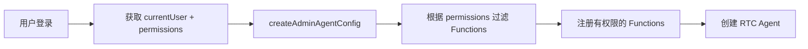
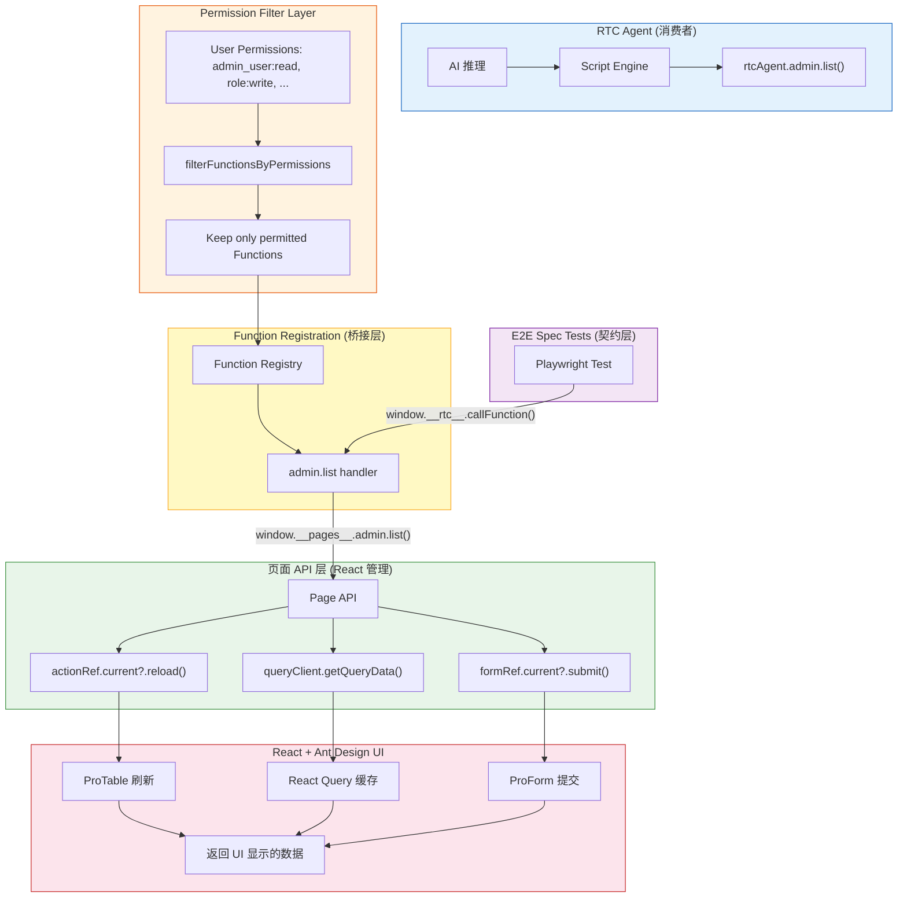
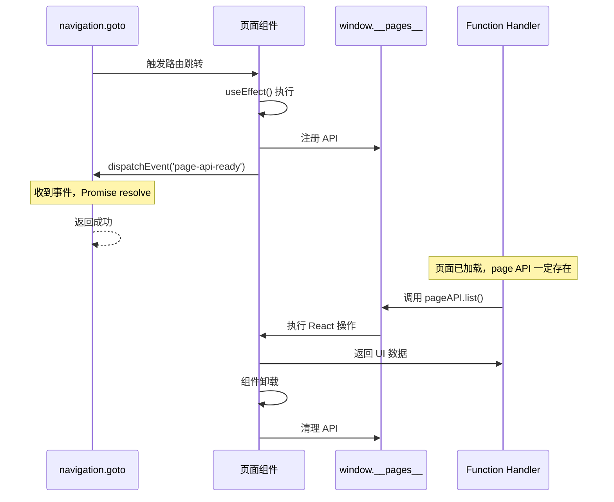
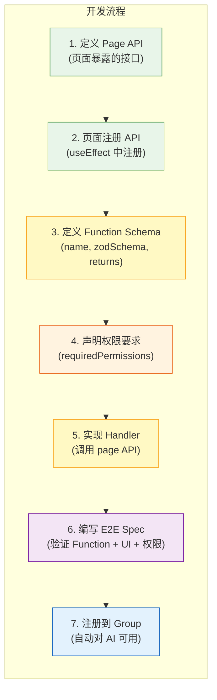
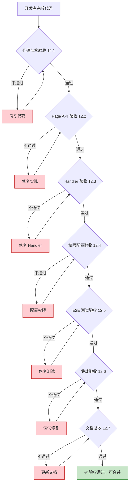

# Function Registration 分层架构设计

## 1. 设计原则

### 原则 1：Function 像人一样操作 UI

Function Handler **调用页面暴露的 React API**，而不是：

- ❌ 直接操作 DOM
- ❌ 绕过 UI 调用后端 API

页面 API 使用 **React 原生方式**（actionRef, formRef, React Query），返回的数据 **= UI 中显示的数据**（Agent 看到的 = 用户看到的）。

### 原则 2：事件驱动的页面就绪机制

使用**事件机制**确保页面加载完毕，不使用 `setTimeout`：

```typescript
// 页面组件注册 API 后发送事件
window.__pages__.rule = pageAPI;
window.dispatchEvent(new CustomEvent('page-api-ready', { detail: { page: 'rule' } }));

// navigation.goto 监听事件，确定性等待
if (!window.__pages__?.[pageName]) {
  await new Promise((resolve) => {
    const handler = (e: CustomEvent) => {
      if (e.detail.page === pageName) {
        window.removeEventListener('page-api-ready', handler);
        resolve(true);
      }
    };
    window.addEventListener('page-api-ready', handler);
  });
}
```

**优势**：

- ✅ 确定性等待（事件触发立即 resolve）
- ✅ 不会超时（不依赖固定时间）
- ✅ 无竞态条件（先检查是否已注册）

### 原则 3：E2E Spec 是契约

先写测试 → 再写实现 → 验证通过 → AI 自然能正确调用。不需要测试 RTC Agent 本身，只需要确保 Functions 的行为 100% 正确。

### 原则 4：权限感知的 Function 注册

Functions 根据用户权限动态注册，**用户只能看到和调用自己有权限的 Functions**：

- ✅ 每个 Function 声明 `requiredPermissions`（需要的权限列表）
- ✅ 注册前根据用户权限过滤，无权 Function 不会注册
- ✅ 无权限要求的 Function（如 navigation、auth）所有用户可用
- ✅ E2E 测试也基于权限验证，模拟不同角色测试

**核心流程**：



## 2. 分层架构总览



**关键原则**：

- ✅ **权限过滤** — 注册前根据用户权限过滤 Functions
- ✅ Handler **不直接操作 DOM**
- ✅ Handler **不绕过 UI 调用后端 API**
- ✅ Handler **调用页面暴露的 React API**
- ✅ 页面 API **使用 React 原生方式**（actionRef, formRef, React Query）
- ✅ 返回的数据 **= UI 中显示的数据**

## 3. 目录结构

```
src/
├── pages/
│   ├── table-list/
│   │   ├── index.tsx                    # 页面组件（注册 page API）
│   │   ├── page-api.ts                  # Page API 定义（供 handler 调用）
│   │   └── components/
│   │       ├── CreateForm.tsx
│   │       └── UpdateForm.tsx
│   │
│   └── system/
│       ├── users/                       # 用户管理页面
│       │   ├── index.tsx
│       │   └── page-api.ts
│       ├── roles/                       # 角色管理页面
│       │   ├── index.tsx
│       │   └── page-api.ts
│       ├── permissions/                 # 权限管理页面
│       │   ├── index.tsx
│       │   └── page-api.ts
│       ├── audit-logs/                  # 审计日志页面
│       │   ├── index.tsx
│       │   └── page-api.ts
│       └── configs/                     # 系统配置页面
│           ├── index.tsx
│           └── page-api.ts
│
├── account/
│   ├── center/                          # 个人中心页面（selfAccount.getProfile）
│   │   ├── index.tsx
│   │   └── page-api.ts
│   └── settings/                        # 个人设置页面（selfAccount.updateProfile）
│       ├── index.tsx
│       └── page-api.ts
│
├── rtc-users/
│   ├── management/                      # RTC 用户管理页面
│   │   ├── index.tsx
│   │   └── page-api.ts
│   ├── sessions/                        # RTC 会话管理页面
│   │   ├── index.tsx
│   │   └── page-api.ts
│   └── messages/                        # RTC 消息管理页面
│       ├── index.tsx
│       └── page-api.ts
│
├── user/
│   └── management/                      # 管理员管理页面
│       ├── index.tsx
│       └── page-api.ts
│
├── rtc-agent/
│   ├── index.ts                         # 入口：组装 agentConfig（含权限过滤）
│   ├── permission-filter.ts             # 权限过滤逻辑
│   ├── test-harness.ts                  # 测试桥接（暴露给 Playwright）
│   │
│   ├── utils/
│   │   └── page-loader.ts              # ensurePageLoaded 工具函数
│   │
│   ├── groups/
│   │   ├── index.ts                     # 导出所有 groups
│   │   │
│   │   ├── navigation/                  # 页面导航（无权限要求）
│   │   │   ├── index.ts
│   │   │   ├── goto.ts
│   │   │   └── page-registry.ts         # 页面定义和权限过滤
│   │   │
│   │   ├── user/                        # 管理员管理（需要 admin_user:* 权限）
│   │   │   ├── index.ts
│   │   │   ├── list.ts                  # requiredPermissions: [{ resource: 'admin_user', action: 'read' }]
│   │   │   ├── create.ts               # requiredPermissions: [{ resource: 'admin_user', action: 'write' }]
│   │   │   ├── update.ts               # requiredPermissions: [{ resource: 'admin_user', action: 'write' }]
│   │   │   └── remove.ts               # requiredPermissions: [{ resource: 'admin_user', action: 'delete' }]
│   │   │
│   │   ├── role/                        # 角色管理（需要 role:read/write 权限）
│   │   │   ├── index.ts
│   │   │   ├── list.ts                  # requiredPermissions: [{ resource: 'role', action: 'read' }]
│   │   │   ├── create.ts               # requiredPermissions: [{ resource: 'role', action: 'write' }]
│   │   │   ├── update.ts               # requiredPermissions: [{ resource: 'role', action: 'write' }]
│   │   │   └── remove.ts               # requiredPermissions: [{ resource: 'role', action: 'write' }]
│   │   │
│   │   ├── permission/                  # 权限管理（需要 permission:read/write 权限）
│   │   │   ├── index.ts
│   │   │   ├── list.ts                  # requiredPermissions: [{ resource: 'permission', action: 'read' }]
│   │   │   ├── create.ts               # requiredPermissions: [{ resource: 'permission', action: 'write' }]
│   │   │   └── remove.ts               # requiredPermissions: [{ resource: 'permission', action: 'write' }]
│   │   │
│   │   ├── userRole/                    # 管理员角色分配（需要 admin_user_role:read/write 权限）
│   │   │   ├── index.ts
│   │   │   ├── list.ts                  # requiredPermissions: [{ resource: 'admin_user_role', action: 'read' }]
│   │   │   ├── assign.ts               # requiredPermissions: [{ resource: 'admin_user_role', action: 'write' }]
│   │   │   └── revoke.ts               # requiredPermissions: [{ resource: 'admin_user_role', action: 'write' }]
│   │   │
│   │   ├── auditLog/                    # 审计日志（需要 audit_log:read 权限）
│   │   │   ├── index.ts
│   │   │   └── list.ts                  # requiredPermissions: [{ resource: 'audit_log', action: 'read' }]
│   │   │
│   │   └── serverConfig/                # 系统配置管理（需要 server_config:read/write/delete 权限）
│   │       ├── index.ts
│   │       ├── list.ts                  # requiredPermissions: [{ resource: 'server_config', action: 'read' }]
│   │       ├── update.ts               # requiredPermissions: [{ resource: 'server_config', action: 'write' }]
│   │       └── remove.ts               # requiredPermissions: [{ resource: 'server_config', action: 'delete' }]
│   │   │
│   │   ├── selfAccount/                 # 个人账号管理（无权限要求，所有已登录管理员可用）
│   │   │   ├── index.ts
│   │   │   ├── get-profile.ts           # requiredPermissions: [] (no permission required)
│   │   │   └── update-profile.ts        # requiredPermissions: [] (no permission required)
│   │   │
│   │   ├── rtcUser/                     # RTC 用户管理（需要 rtc_user:read/ban 权限）
│   │   │   ├── index.ts
│   │   │   ├── list.ts                  # requiredPermissions: [{ resource: 'rtc_user', action: 'read' }]
│   │   │   ├── ban.ts                   # requiredPermissions: [{ resource: 'rtc_user', action: 'ban' }]
│   │   │   ├── unban.ts                 # requiredPermissions: [{ resource: 'rtc_user', action: 'ban' }]
│   │   │   ├── devices.ts               # requiredPermissions: [{ resource: 'rtc_user', action: 'read' }]
│   │   │   └── tokenStats.ts            # requiredPermissions: [{ resource: 'rtc_user', action: 'read' }]
│   │   │
│   │   ├── rtcSession/                  # RTC 会话管理（需要 rtc_session:read 权限）
│   │   │   ├── index.ts
│   │   │   └── list.ts                  # requiredPermissions: [{ resource: 'rtc_session', action: 'read' }]
│   │   │
│   │   └── rtcMessage/                  # RTC 消息管理（需要 rtc_message:read 权限）
│   │       ├── index.ts
│   │       └── list.ts                  # requiredPermissions: [{ resource: 'rtc_message', action: 'read' }]
│   │
│   └── e2e/                             # Playwright E2E 测试
│       ├── fixtures/
│       │   └── rtc-functions.ts        # 自定义 fixture：暴露 function 调用（含权限模拟）
│       └── specs/
│           ├── user.spec.ts             # 测试 admin:* 权限的 functions
│           ├── role.spec.ts
│           ├── permission.spec.ts
│           ├── auditLog.spec.ts
│           ├── serverConfig.spec.ts      # 测试 server_config:* 权限的 functions
│           ├── userRole.spec.ts         # 测试 admin_user_role:* 权限的 functions
│           ├── selfAccount.spec.ts      # 测试 selfAccount（无权限要求）functions
│           ├── rtcUser.spec.ts          # 测试 rtc_user:* 权限的 functions
│           ├── rtcSession.spec.ts       # 测试 rtc_session:* 权限的 functions
│           └── rtcMessage.spec.ts       # 测试 rtc_message:* 权限的 functions
```

## 4. 完整实现示例：角色管理（Role Management）

> **本节说明**：以角色管理为参考实现，展示完整的 Function 注册模式。后续实现新 Function 时，按照相同的文件结构和代码模式进行。

### 4.1 Step 1: Page API 类型定义

**文件路径**: `src/pages/system/roles/page-api.ts`

```typescript
/**
 * 管理员角色管理页面的 API 接口
 *
 * 页面组件在挂载时注册这些 API 到 window.__pages__
 * Function handler 通过调用这些 API 来操作 UI
 *
 * 关键原则：
 * - 使用 React 原生方式（actionRef, React Query）
 * - 返回 UI 中显示的数据
 * - 不直接操作 DOM
 */

import type { ActionType } from '@ant-design/pro-components';
import type { RoleInfo } from '@/services/admin-auth';

export interface RolePageAPI {
  /**
   * 读取表格当前显示的数据
   * 调用 service 函数获取后端数据，与 UI 显示一致
   */
  list: (params?: {
    current?: number;
    pageSize?: number;
    keyword?: string;
  }) => Promise<{
    success: boolean;
    data: RoleInfo[];
    total: number;
  }>;

  /**
   * 刷新表格
   * 调用 actionRef.current?.reload()
   */
  refresh: () => Promise<void>;

  /**
   * 创建管理员角色
   * 触发创建流程（打开弹窗、填充表单、提交）
   */
  create: (data: {
    name: string;
    display_name: string;
    description?: string;
    is_enabled?: boolean;
  }) => Promise<{ success: boolean; id?: string }>;

  /**
   * 更新管理员角色
   * 触发更新流程（打开弹窗、填充数据、提交）
   */
  update: (data: {
    id: string;
    name?: string;
    display_name?: string;
    description?: string;
    is_enabled?: boolean;
  }) => Promise<{ success: boolean }>;

  /**
   * 删除管理员角色
   */
  remove: (
    ids: string[],
  ) => Promise<{ success: boolean; deletedCount?: number }>;
}

// 全局类型声明
declare global {
  interface Window {
    __pages__?: {
      role?: RolePageAPI;
    };
  }
}
```

### 4.2 Step 2: 页面组件注册 API

**文件路径**: `src/pages/system/roles/index.tsx`

```typescript
import {
  DeleteOutlined,
  EditOutlined,
  PlusOutlined,
  SafetyOutlined,
} from '@ant-design/icons';
import type { ActionType, ProColumns } from '@ant-design/pro-components';
import {
  ModalForm,
  PageContainer,
  ProFormText,
  ProFormTextArea,
  ProTable,
} from '@ant-design/pro-components';
import { Access, useAccess, useIntl } from '@umijs/max';
import {
  Button,
  Checkbox,
  Modal,
  message,
  Popconfirm,
  Space,
  Switch,
  Tag,
  Tooltip,
  theme,
} from 'antd';
import React, { useEffect, useRef, useState } from 'react';
import { getActionTypes, getResourceTypes } from '@/constants/permissions';
import {
  createPermission,
  deletePermission,
  getPermissionList,
  type PermissionPolicy,
} from '@/services/permission';
import {
  createRole,
  deleteRole,
  getRoleList,
  patchRole,
  updateRole,
} from '@/services/role';
import { getFriendlyErrorMessage } from '@/utils/errorHandler';
import type { RoleFormValues, RoleTableItem } from './data.d';
import type { RolePageAPI } from './page-api';

/**
 * 管理员角色管理页面
 */
const RoleListPage: React.FC = () => {
  const actionRef = useRef<ActionType>(null);
  const access = useAccess();
  const intl = useIntl();
  const [currentRow, setCurrentRow] = useState<RoleTableItem>();
  const [modalVisible, setModalVisible] = useState(false);
  const { token } = theme.useToken();
  const [isEdit, setIsEdit] = useState(false);
  const [permissionModalVisible, setPermissionModalVisible] = useState(false);
  const [rolePermissions, setRolePermissions] = useState<PermissionPolicy[]>(
    [],
  );
  /** 正在切换中的权限 key（resource:action），防止快速点击导致竞态 */
  const [togglingPermission, setTogglingPermission] = useState<string | null>(
    null,
  );

  const RESOURCE_TYPES = getResourceTypes(intl);
  const ACTION_TYPES = getActionTypes(intl);

  // === 注册 Page API ===
  useEffect(() => {
    const pageAPI: RolePageAPI = {
      // 读取表格数据
      list: async (params = {}) => {
        const { current = 1, pageSize = 20, keyword } = params;

        try {
          const response = await getRoleList({
            page: current,
            page_size: pageSize,
            keyword,
          });

          return {
            success: true,
            data: response.items,
            total: response.total,
          };
        } catch (error) {
          console.error('[Role Page API] list failed:', error);
          return {
            success: false,
            data: [],
            total: 0,
          };
        }
      },

      // 刷新表格
      refresh: async () => {
        actionRef.current?.reload();
      },

      // 创建管理员角色
      create: async (data) => {
        try {
          const result = await createRole(data);
          actionRef.current?.reload();
          return { success: true, id: result.id };
        } catch (error) {
          console.error('[Role Page API] create failed:', error);
          return { success: false };
        }
      },

      // 更新管理员角色
      update: async (data) => {
        try {
          const { id, ...updateData } = data;
          await updateRole(id, updateData);
          actionRef.current?.reload();
          return { success: true };
        } catch (error) {
          console.error('[Role Page API] update failed:', error);
          return { success: false };
        }
      },

      // 删除管理员角色
      remove: async (ids) => {
        try {
          let deletedCount = 0;
          for (const id of ids) {
            await deleteRole(id);
            deletedCount++;
          }
          actionRef.current?.reload();
          return { success: true, deletedCount };
        } catch (error) {
          console.error('[Role Page API] remove failed:', error);
          return { success: false };
        }
      },
    };

    // 注册到全局
    window.__pages__ = window.__pages__ || {};
    window.__pages__.role = pageAPI;

    // 发送就绪事件（通知 navigation.goto 页面已加载）
    window.dispatchEvent(
      new CustomEvent('page-api-ready', { detail: { page: 'role' } }),
    );

    console.log('[RoleListPage] Page API registered');

    // 清理
    return () => {
      delete window.__pages__?.role;
      console.log('[RoleListPage] Page API unregistered');
    };
  }, []);

  // ... 原有的 ProTable 代码 ...

  return (
    <PageContainer>
      <ProTable<RoleTableItem>
        actionRef={actionRef}
        request={async (params) => {
          const response = await getRoleList({
            page: params.current,
            page_size: params.pageSize,
            keyword: params.keyword,
          });
          return {
            data: response.items,
            total: response.total,
            success: true,
          };
        }}
        // ... 其他配置
      />
    </PageContainer>
  );
};

export default RoleListPage;
```

### 4.3 Step 3: Function Handler 实现

#### 4.3.1 查询操作 (list)

**文件路径**: `src/rtc-agent/groups/role/list.ts`

```typescript
import { withMeta, z } from '@rtc-agent/component';
import type { PermissionAwareFunctionDef } from '@/rtc-agent/permission-filter';
import { ensurePageLoaded } from '@/rtc-agent/utils/page-loader';

/**
 * Query admin role list
 *
 * Permission required: role:read
 *
 * Implementation:
 * - Calls the page-exposed React API (window.__pages__.role.list)
 * - Page API calls the backend API via service function
 * - Returned data matches what is displayed in the UI table
 *
 * Prerequisite: navigation.goto has ensured the page is loaded and page API is registered
 */
export const listRoles: PermissionAwareFunctionDef = {
  name: 'list',
  description:
    'Query admin role list, returns the data currently displayed in the table',

  requiredPermissions: [{ resource: 'role', action: 'read' }],

  zodSchema: z.object({
    current: withMeta(z.number().int().positive(), { example: 1 })
      .optional()
      .describe('Current page number, defaults to 1'),
    pageSize: withMeta(z.number().int().positive(), { example: 20 })
      .optional()
      .describe('Items per page, defaults to 20'),
    keyword: withMeta(z.string(), { example: 'admin' })
      .optional()
      .describe(
        'Keyword search (admin role name, display name, or description)',
      ),
  }),

  returns: {
    zodSchema: z
      .object({
        success: z.boolean().describe('Whether successful'),
        data: z
          .array(
            z.object({
              id: z.string().describe('Admin role ID'),
              name: z.string().describe('Admin role name'),
              display_name: z.string().describe('Display name'),
              description: z.string().optional().describe('Description'),
              is_system: z
                .boolean()
                .optional()
                .describe('Whether it is a system admin role'),
              is_enabled: z.boolean().optional().describe('Whether enabled'),
              created_at: z.string().optional().describe('Creation time'),
              updated_at: z.string().optional().describe('Update time'),
            }),
          )
          .describe('Admin role list (matches UI table display)'),
        total: z.number().describe('Total count'),
      })
      .describe('Admin role list query result'),
  },

  handler: async (params) => {
    const {
      current = 1,
      pageSize = 20,
      keyword,
    } = params as {
      current?: number;
      pageSize?: number;
      keyword?: string;
    };

    // Ensure page is loaded
    await ensurePageLoaded('role', '/system/roles');

    // Page is loaded, call API directly
    const pageAPI = window.__pages__?.role;
    if (!pageAPI) {
      throw new Error('Role page failed to load. Please try again.');
    }

    return await pageAPI.list({ current, pageSize, keyword });
  },

  hooks: {
    onStart: () => {
      console.log('[role.list] Reading admin role list...');
    },
    onSuccess: (result) => {
      console.log(
        `[role.list] Read successful, total ${(result as any).total} records`,
      );
    },
    onError: (error) => {
      console.error('[role.list] Read failed:', error.message);
    },
  },
};
```

#### 4.3.2 创建操作 (create)

**文件路径**: `src/rtc-agent/groups/role/create.ts`

```typescript
import { withMeta, z } from '@rtc-agent/component';
import type { PermissionAwareFunctionDef } from '@/rtc-agent/permission-filter';
import { ensurePageLoaded } from '@/rtc-agent/utils/page-loader';

/**
 * Create admin role
 *
 * Permission required: role:write
 *
 * Implementation:
 * - Calls page API to trigger create flow
 * - Page API internally uses React patterns (actionRef, mutation)
 * - Table auto-refreshes after successful creation
 */
export const createRole: PermissionAwareFunctionDef = {
  name: 'create',
  description:
    'Create a new admin role, the table will auto-refresh after successful creation',

  requiredPermissions: [{ resource: 'role', action: 'write' }],

  zodSchema: z.object({
    name: withMeta(z.string(), { example: 'editor' }).describe(
      'Admin role name (unique identifier)',
    ),
    display_name: withMeta(z.string(), { example: 'Editor' }).describe(
      'Display name',
    ),
    description: withMeta(z.string(), {
      example: 'A role that can edit content',
    })
      .optional()
      .describe('Admin role description'),
    is_enabled: withMeta(z.boolean(), { example: true })
      .optional()
      .describe('Whether enabled, defaults to true'),
  }),

  returns: {
    zodSchema: z
      .object({
        success: z.boolean().describe('Whether successful'),
        id: z.string().optional().describe('Newly created admin role ID'),
      })
      .describe('Creation result'),
  },

  handler: async (params) => {
    const {
      name,
      display_name,
      description,
      is_enabled = true,
    } = params as {
      name: string;
      display_name: string;
      description?: string;
      is_enabled?: boolean;
    };

    // Ensure page is loaded
    await ensurePageLoaded('role', '/system/roles');

    // Page is loaded, call API directly
    const pageAPI = window.__pages__?.role;
    if (!pageAPI) {
      throw new Error('Role page failed to load. Please try again.');
    }

    return await pageAPI.create({
      name,
      display_name,
      description,
      is_enabled,
    });
  },

  hooks: {
    onStart: () => {
      console.log('[role.create] Creating admin role...');
    },
    onSuccess: (result) => {
      console.log(
        `[role.create] Creation successful, ID: ${(result as any).id}`,
      );
    },
    onError: (error) => {
      console.error('[role.create] Creation failed:', error.message);
    },
  },
};
```

#### 4.3.3 更新操作 (update)

**文件路径**: `src/rtc-agent/groups/role/update.ts`

```typescript
import { withMeta, z } from '@rtc-agent/component';
import type { PermissionAwareFunctionDef } from '@/rtc-agent/permission-filter';
import { ensurePageLoaded } from '@/rtc-agent/utils/page-loader';

/**
 * Update admin role
 *
 * Permission required: role:write
 *
 * Implementation:
 * - Calls page API to trigger update flow
 * - Page API internally uses React patterns
 * - Table auto-refreshes after successful update
 */
export const updateRole: PermissionAwareFunctionDef = {
  name: 'update',
  description:
    'Update admin role information, the table will auto-refresh after successful update',

  requiredPermissions: [{ resource: 'role', action: 'write' }],

  zodSchema: z.object({
    id: withMeta(z.string(), { example: '01a10622-...' }).describe(
      'Admin role ID',
    ),
    name: withMeta(z.string(), { example: 'editor' })
      .optional()
      .describe('Admin role name'),
    display_name: withMeta(z.string(), { example: 'Editor' })
      .optional()
      .describe('Display name'),
    description: withMeta(z.string(), {
      example: 'A role that can edit content',
    })
      .optional()
      .describe('Admin role description'),
    is_enabled: withMeta(z.boolean(), { example: true })
      .optional()
      .describe('Whether enabled'),
  }),

  returns: {
    zodSchema: z
      .object({
        success: z.boolean().describe('Whether successful'),
      })
      .describe('Update result'),
  },

  handler: async (params) => {
    const { id, name, display_name, description, is_enabled } = params as {
      id: string;
      name?: string;
      display_name?: string;
      description?: string;
      is_enabled?: boolean;
    };

    // Ensure page is loaded
    await ensurePageLoaded('role', '/system/roles');

    // Page is loaded, call API directly
    const pageAPI = window.__pages__?.role;
    if (!pageAPI) {
      throw new Error('Role page failed to load. Please try again.');
    }

    return await pageAPI.update({
      id,
      name,
      display_name,
      description,
      is_enabled,
    });
  },

  hooks: {
    onStart: () => {
      console.log('[role.update] Updating admin role...');
    },
    onSuccess: () => {
      console.log('[role.update] Update successful');
    },
    onError: (error) => {
      console.error('[role.update] Update failed:', error.message);
    },
  },
};
```

#### 4.3.4 删除操作 (remove)

**文件路径**: `src/rtc-agent/groups/role/remove.ts`

```typescript
import { withMeta, z } from '@rtc-agent/component';
import type { PermissionAwareFunctionDef } from '@/rtc-agent/permission-filter';
import { ensurePageLoaded } from '@/rtc-agent/utils/page-loader';

/**
 * Delete admin role
 *
 * Permission required: role:write
 *
 * Implementation:
 * - Calls page API to trigger delete flow
 * - Page API internally uses React patterns (mutation)
 * - Table auto-refreshes after successful deletion
 */
export const removeRole: PermissionAwareFunctionDef = {
  name: 'remove',
  description:
    'Delete admin roles, the table will auto-refresh after successful deletion',

  requiredPermissions: [{ resource: 'role', action: 'write' }],

  zodSchema: z.object({
    ids: withMeta(z.array(z.string()), { example: ['01a10622-...'] }).describe(
      'List of admin role IDs to delete',
    ),
  }),

  returns: {
    zodSchema: z
      .object({
        success: z.boolean().describe('Whether successful'),
        deletedCount: z.number().optional().describe('Number of deleted roles'),
      })
      .describe('Deletion result'),
  },

  handler: async (params) => {
    const { ids } = params as { ids: string[] };

    // Ensure page is loaded
    await ensurePageLoaded('role', '/system/roles');

    // Page is loaded, call API directly
    const pageAPI = window.__pages__?.role;
    if (!pageAPI) {
      throw new Error('Role page failed to load. Please try again.');
    }

    return await pageAPI.remove(ids);
  },

  hooks: {
    onStart: (params) => {
      const ids = (params as any)?.ids || [];
      console.log(`[role.remove] Deleting ${ids.length} admin role(s)...`);
    },
    onSuccess: (result) => {
      console.log(
        `[role.remove] Deletion successful, deleted ${(result as any).deletedCount || 1} role(s)`,
      );
    },
    onError: (error) => {
      console.error('[role.remove] Deletion failed:', error.message);
    },
  },
};
```

### 4.4 Step 4: Function Group 定义

**文件路径**: `src/rtc-agent/groups/role/index.ts`

```typescript
import type { PermissionAwareFunctionDef } from '@/rtc-agent/permission-filter';
import { createRole } from './create';
import { listRoles } from './list';
import { removeRole } from './remove';
import { updateRole } from './update';

/**
 * Admin Role Management Function Group
 *
 * Corresponds to route: /system/roles
 *
 * All functions call the page-exposed React API:
 * - window.__pages__.role.list()
 * - window.__pages__.role.create()
 * - window.__pages__.role.update()
 * - window.__pages__.role.remove()
 *
 * Permission requirements:
 * - list: role:read
 * - create, update, remove: role:write
 */
export const roleGroup = {
  name: 'role',
  description:
    'Admin role management module, supports CRUD operations on admin roles. All operations are reflected in the UI table.',
  functions: [
    listRoles,
    createRole,
    updateRole,
    removeRole,
  ] as PermissionAwareFunctionDef[],
};
```

### 4.5 Step 5: 注册到总入口

**文件路径**: `src/rtc-agent/index.ts`

```typescript
import type { AgentConfig } from '@rtc-agent/component';
import { buildPermissionSet } from './permission-filter';
import type { Permission } from './permission-filter';
import { createNavigationGroup, roleGroup } from './groups';
// ... 其他 groups

/**
 * 创建所有 Function Groups（根据用户权限过滤）
 *
 * @param userPermissions - 当前用户的权限列表（来自 /api/auth/me）
 */
export function createAllGroups(userPermissions: Permission[]) {
  const permissionSet = buildPermissionSet(userPermissions);

  return [createNavigationGroup(permissionSet), roleGroup];
}

/**
 * 创建 admin-ui 的 AgentConfig
 *
 * Note: Permission filtering is done by rtc-agent-manager.ts before calling this function
 * This function only assembles the final AgentConfig
 *
 * @param filteredGroups - 经过权限过滤后的 Function Groups
 */
export function createAdminAgentConfig(
  filteredGroups: Array<{
    name: string;
    description?: string;
    functions: any[];
  }>,
): Partial<AgentConfig> {
  if (process.env.NODE_ENV === 'development') {
    console.log('[AdminAgentConfig] Filtered groups:',
      filteredGroups.map((g) => `${g.name}(${g.functions.length} functions)`)
    );
  }

  return {
    name: 'AdminUI',
    description: 'AI assistant for the admin dashboard',
    persona: `You are the AI assistant of an admin dashboard. You help administrators navigate the system and manage admin roles, permissions, and audit logs through the registered functions. Always act through registered functions. If a function is unavailable, the current admin lacks the required permission — explain this clearly. Be concise, confirm operations with relevant details, and match the user's language.`,
    groups: filteredGroups as any, // Type cast: PermissionAwareFunctionDef[] is compatible with AgentFunctionGroup
  };
}
```

## 5. Page API 模式详解

### 5.1 为什么使用 Page API 模式？

#### 直接操作 DOM

- 优点：简单直接
- 缺点：❌ 违反 React 原则；❌ 不稳定（DOM 结构变化）；❌ 无法访问 React 状态

#### 直接调后端 API

- 优点：不依赖 UI
- 缺点：❌ 绕过 UI，数据不一致；❌ 用户看到的不一样；❌ 无法触发 UI 更新

#### Page API 模式（推荐）

- 优点：✅ 使用 React 原生方式；✅ 数据与 UI 一致；✅ 自动触发 UI 更新；✅ 稳定可靠
- 缺点：需要页面注册 API

### 5.2 Page API 注册时机（事件机制）



**关键机制**：

- `navigation.goto` 监听 `page-api-ready` 事件
- 页面组件在 `useEffect` 中注册 API 后发送事件
- `navigation.goto` 收到事件后才返回
- 后续 Function 可以直接调用 page API，无需等待

### 5.3 Page API 可用资源

页面 API 可以访问页面内的所有 React 资源：

- **actionRef** - 操作 ProTable：`actionRef.current?.reload()`
- **formRef** - 操作 ProForm：`formRef.current?.submit()`
- **queryClient** - 访问 React Query 缓存：`queryClient.getQueryData(['rule'])`（如果使用 React Query）
- **React State** - 读取/更新组件状态：`setState(newValue)`
- **组件方法** - 调用组件暴露的方法：`modalRef.current?.open()`

### 5.4 Page API 设计原则

1. **返回 UI 可见数据** - API 返回的数据必须与 UI 显示一致
2. **触发 UI 更新** - 修改操作后，UI 应该自动更新
3. **使用 React 方式** - 不直接操作 DOM，使用 actionRef、formRef 等
4. **错误处理** - API 应该捕获异常并返回结构化错误
5. **类型安全** - 定义清晰的 TypeScript 接口

## 6. 开发工作流



```
1. 定义 Page API    → 明确页面暴露的接口（类型、参数、返回值）
2. 页面注册 API    → 在 useEffect 中注册到 window.__pages__
3. 定义 Schema    → 明确 Function 的输入输出契约
4. 声明权限要求   → 设置 requiredPermissions（为空则所有用户可用）
5. 实现 Handler   → 调用 page API（不直接操作 DOM 或后端）
6. 编写 E2E Spec  → 用 Playwright 验证 Function 行为、UI 状态、权限过滤
7. 注册到 Group   → AI 自动发现并可以调用（受权限控制）
```

## 7. 测试策略

### 7.1 测试层级

- **E2E Spec** - 测试对象：Function 行为 + UI 状态；工具：Playwright；频率：每次 CI
- **Unit Test** - 测试对象：Page API 逻辑；工具：Vitest；频率：每次提交
- **集成测试** - 测试对象：Group → RTC Agent；工具：Playwright；频率：每周

### 7.2 E2E Spec 测试内容

1. **返回值验证**：Function 返回的数据结构是否符合 schema
2. **UI 状态验证**：Function 执行后 UI 是否正确更新（表格刷新、弹窗关闭等）
3. **数据一致性**：Function 返回的数据与 UI 显示的数据是否一致
4. **边界情况**：空数据、分页边界、错误处理
5. **性能验证**：Function 执行时间是否合理

## 8. 新增 Page + Group 模板

当需要添加新的 Page + Function Group 时，按以下步骤：

### Step 1: 创建 Page API 类型定义

```typescript
// src/pages/<page-name>/page-api.ts

export interface MyPageAPI {
  list: (params?: ListParams) => Promise<ListResult>;
  create: (data: CreateData) => Promise<CreateResult>;
  update: (data: UpdateData) => Promise<UpdateResult>;
  remove: (ids: number[]) => Promise<RemoveResult>;
}

declare global {
  interface Window {
    __pages__?: {
      myPage?: MyPageAPI;
    };
  }
}
```

### Step 2: 页面组件注册 API

```typescript
// src/pages/<page-name>/index.tsx

import type { MyPageAPI } from './page-api';

const MyPage: React.FC = () => {
  const actionRef = useRef<ActionType>(null);
  const queryClient = useQueryClient();

  useEffect(() => {
    const pageAPI: MyPageAPI = {
      list: async (params) => {
        // 从后端 API 读取（或使用 React Query 缓存）
        return queryClient.getQueryData(['myData', params]);
      },
      create: async (data) => {
        // 调用后端 API
        const result = await fetch('/api/myData', { method: 'POST', body: JSON.stringify(data) });
        // 刷新表格
        actionRef.current?.reload();
        return result.json();
      },
      // ... 其他方法
    };

    window.__pages__ = window.__pages__ || {};
    window.__pages__.myPage = pageAPI;

    return () => {
      delete window.__pages__?.myPage;
    };
  }, []);

  return <ProTable actionRef={actionRef} request={...} />;
};
```

### Step 3: 实现 Function Handler（含权限声明）

```typescript
// src/rtc-agent/groups/my-group/list.ts
import { z, withMeta } from '@rtc-agent/component';
import type { FunctionDef } from '@rtc-agent/component';

export const listMyData: FunctionDef = {
  name: 'list',
  description: '查询数据列表',

  // === 权限声明 ===
  // 如果这个 Function 需要特定权限，在这里声明
  // 为空或省略表示所有用户可用
  requiredPermissions: [{ resource: 'my_resource', action: 'read' }],

  zodSchema: z.object({ /* params */ }),
  returns: { zodSchema: z.object({ /* returns */ }) },

  handler: async (params) => {
    // 调用页面 API（不是直接操作 DOM 或后端）
    const pageAPI = window.__pages__?.myPage;
    if (!pageAPI) {
      throw new Error('Page not loaded. Please navigate to the page first.');
    }
    return await pageAPI.list(params);
  },
};
```

### Step 4: 创建 Function Group

```typescript
// src/rtc-agent/groups/my-group/index.ts
import type { AgentFunctionGroup } from '@rtc-agent/component';
import { listMyData } from './list';
import { createMyData } from './create';

export const myGroup: AgentFunctionGroup = {
  name: 'myGroup',
  description: '我的模块',
  functions: [
    listMyData,    // requiredPermissions: [{ resource: 'my_resource', action: 'read' }]
    createMyData,  // requiredPermissions: [{ resource: 'my_resource', action: 'write' }]
  ],
};
```

### Step 5: 注册到总入口

```typescript
// src/rtc-agent/index.ts
import { myGroup } from './groups/my-group';

const allGroups = [
  // ... 其他 groups
  myGroup,  // 添加新的 group
];

// createAdminAgentConfig 会根据用户权限自动过滤
export function createAdminAgentConfig(userPermissions: Permission[]): Partial<AgentConfig> {
  const filteredGroups = filterGroupsByPermissions(allGroups, userPermissions);
  return { groups: filteredGroups };
}
```

### Step 6: 编写 E2E Spec（含权限测试）

```typescript
// src/rtc-agent/e2e/specs/my-group.spec.ts
import { expect, test } from '../fixtures/rtc-functions';

test.describe('myGroup', () => {
  test('list - 有权限时可以读取数据', async ({ loginAs, callFunction }) => {
    await loginAs('admin'); // admin 有 my_resource:read 权限

    const result = await callFunction('myGroup.list', {});
    expect(result).toHaveProperty('data');
  });

  test('list - 无权限时 Function 不可用', async ({ loginAs, callFunction }) => {
    await loginAs('viewer'); // viewer 没有 my_resource:read 权限

    // Function 不存在（被权限过滤掉了）
    await expect(
      callFunction('myGroup.list', {})
    ).rejects.toThrow(/Function not found/);
  });
});
```

## 9. 命名规范

- **Group Name** - 小写名词，表示业务领域：`rule`, `user`, `order`
- **Function Name** - 动词或动宾短语：`list`, `create`, `update`
- **文件命名** - camelCase：`listRule.ts`, `createUser.ts`
- **Spec 命名** - camelCase + `.spec.ts`：`rule.spec.ts`
- **Page API 命名** - 与 Group 对应：`window.__pages__.rule`
- **路由路径** - `/` 分隔：`/list/table-list`

## 10. 权限与 Functions 对应关系

### 10.1 权限矩阵

|Group|Function|requiredPermissions|对应路由|页面 access|
|---|---|---|---|---|
|**navigation**|goto, getCurrentPage, listPages|无（所有用户可用）|所有页面|-|
|**auth**|currentUser, hasPermission, logout|无（所有用户可用）|-|-|
|**admin**|list|`admin_user:read`|/system/users|canUserView|
|**admin**|create, update|`admin_user:write`|/system/users|canUserEdit|
|**admin**|remove|`admin_user:delete`|/system/users|canUserDelete|
|**role**|list|`role:read`|/system/roles|canRoleView|
|**role**|create, update, remove|`role:write`|/system/roles|canRoleEdit|
|**permission**|list|`permission:read`|/system/permissions|canPermissionView|
|**permission**|create, update, remove|`permission:write`|/system/permissions|canPermissionEdit|
|**adminRole**|list|`admin_user_role:read`|/system/users|canAdminUserRoleView|
|**adminRole**|assign, revoke|`admin_user_role:write`|/system/users|canAdminUserRoleEdit|
|**auditLog**|list|`audit_log:read`|/system/audit-logs|canAuditLogView|
|**serverConfig**|list|`server_config:read`|/system/configs|canServerConfigView|
|**serverConfig**|update|`server_config:write`|/system/configs|canServerConfigEdit|
|**serverConfig**|remove|`server_config:delete`|/system/configs|canServerConfigDelete|
|**selfAccount**|getProfile|无（所有已登录管理员可用）|/account/center|-|
|**selfAccount**|updateProfile|无（所有已登录管理员可用）|/account/settings|-|
|**rtcUser**|list|`rtc_user:read`|/rtc-users/management|canRtcUserView|
|**rtcUser**|devices, tokenStats|`rtc_user:read`|/rtc-users/management|canRtcUserView|
|**rtcUser**|ban, unban|`rtc_user:ban`|/rtc-users/management|canRtcUserBan|
|**rtcSession**|list|`rtc_session:read`|/rtc-users/sessions|canRtcSessionView|
|**rtcMessage**|list|`rtc_message:read`|/rtc-users/messages|canRtcMessageView|

*注：`access.ts` 中未定义 `canRoleDelete` / `canPermissionDelete` / `canUserRoleDelete`，删除操作复用对应的 `write` 权限检查。后端权限虽然区分了 `read/write/delete`，但前端 Function 的 `requiredPermissions` 与 `access.ts` 保持一致。`admin_user_role` 是独立权限资源，与 `admin_user` 分离。`selfAccount` 无需特殊权限，所有已登录管理员可用。`rtc_user` 权限区分 `read` 和 `ban`（ban 操作使用独立的 `ban` action，而非 `write`）。*

### 10.2 角色权限映射

|角色|权限|可用的 Functions|
|---|---|---|
|**admin**|所有权限|所有 Functions|
|**operator**|`admin_user:read`, `admin_user:write`, `role:read`|navigation, auth, selfAccount, admin.list/create/update, role.list, rtcUser.list/devices/tokenStats, rtcSession.list, rtcMessage.list|
|**viewer**|`admin_user:read`|navigation, auth, selfAccount, admin.list|

### 10.3 权限过滤流程图

```mermaid
flowchart TB
    A[用户登录] --> B[GET /api/auth/me]
    B --> C[获取 permissions 数组]
    C --> D[GlobalRtcAgent 等待 initialState]
    D --> E[调用 mountRtcAgent\(permissions\)]
    E --> F[createAdminAgentConfig\(permissions\)]
    F --> G[filterGroupsByPermissions]
    
    G --> H{遍历每个 Function}
    H --> I{requiredPermissions?}
    I -->|无| J[保留 Function]
    I -->|有| K{用户拥有所有权限?}
    K -->|是| J
    K -->|否| L[过滤掉 Function]
    
    J --> M[组装过滤后的 Groups]
    L --> M
    M --> N[创建 RTC Agent]
    N --> O[AI 只能看到/调用有权限的 Functions]

    style A fill:#e3f2fd,stroke:#1565c0
    style F fill:#fff3e0,stroke:#e65100
    style G fill:#fff3e0,stroke:#e65100
    style N fill:#e8f5e9,stroke:#388e3c
    style O fill:#e8f5e9,stroke:#388e3c
```

## 11. 注意事项

1. **Handler 调用 Page API** - 不直接操作 DOM，不绕过 UI 调后端
2. **Page API 返回 UI 数据** - 从后端 API 或 React Query 缓存读取，确保与 UI 显示一致
3. **Page API 触发 UI 更新** - 使用 actionRef.reload() 等方法
4. **错误处理** - Handler 和 Page API 都应该捕获异常并返回结构化错误
5. **Hooks 是可选的** - 用于提供 UI 反馈（toast 等）
6. **zodSchema 优先** - 使用 Zod 而不是 OpenAPI 参数定义
7. **测试桥接仅限开发环境** - 生产环境不会暴露 `window.__rtc__`
8. **Page API 生命周期** - 页面挂载时注册，卸载时清理
9. **权限声明** - 每个 Function 应该声明 `requiredPermissions`，为空表示所有用户可用
10. **权限过滤时机** - 在 `createAdminAgentConfig()` 中根据用户权限过滤，不是运行时检查
11. **等待权限信息** - `GlobalRtcAgent` 必须等待 `getInitialState()` 完成（获取 currentUser + permissions）后才挂载 RTC Agent
12. **E2E 测试权限** - 测试时使用 `loginAs(role)` 模拟不同角色，验证权限过滤逻辑

## 12. 新 Function Group 验收标准

> **严格验收**：新增 Function Group 必须通过以下所有检查项，否则不允许合并。

### 12.1 代码结构验收

| #   | 检查项 | 验收标准 | 验证方法 |
| --- | ------ | -------- | -------- |
| 1.1 | Page API 类型定义文件存在 | `src/pages/<page>/page-api.ts` 已创建，定义了完整的接口 | 文件存在性检查 |
| 1.2 | Page API 接口完整 | 包含 `list`, `create`, `update`, `remove`（如适用） | 代码审查 |
| 1.3 | 全局类型声明正确 | `declare global { interface Window { __pages__?: { <page>?: <PageAPI> } } }` | TypeScript 编译通过 |
| 1.4 | Function Handler 文件存在 | `src/rtc-agent/groups/<group>/{list,create,update,remove}.ts` 已创建 | 文件存在性检查 |
| 1.5 | Function Group 定义文件存在 | `src/rtc-agent/groups/<group>/index.ts` 已创建并导出 group | 文件存在性检查 |
| 1.6 | Group 已注册到总入口 | `src/rtc-agent/groups/index.ts` 导出新 group，`src/rtc-agent/index.ts` 引用 | 代码审查 |

### 12.2 Page API 实现验收

| #   | 检查项 | 验收标准 | 验证方法 |
| --- | ------ | -------- | -------- |
| 2.1 | 页面组件注册 Page API | `useEffect` 中创建 `pageAPI` 对象并赋值到 `window.__pages__.<page>` | 代码审查 |
| 2.2 | 发送就绪事件 | `window.dispatchEvent(new CustomEvent('page-api-ready', { detail: { page: '<page>' } }))` | 代码审查 |
| 2.3 | 清理函数 | `useEffect` 返回清理函数：`delete window.__pages__.<page>` | 代码审查 |
| 2.4 | 数据一致性 | `list` 返回的数据结构与 UI 表格显示一致 | E2E 测试验证 |
| 2.5 | 自动刷新 | `create/update/remove` 操作后调用 `actionRef.current?.reload()` | E2E 测试验证 |
| 2.6 | 错误处理 | 所有 API 方法包裹在 `try/catch` 中，返回 `{ success: false }` | 代码审查 |

### 12.3 Function Handler 验收

| # | 检查项 | 验收标准 | 验证方法 |
|---|--------|----------|----------|
| 3.1 | 使用 `PermissionAwareFunctionDef` 类型 | 所有 handler 导出的类型是 `PermissionAwareFunctionDef` | TypeScript 编译通过 |
| 3.2 | 权限声明 | 每个 handler 声明 `requiredPermissions: [{ resource: '<resource>', action: '<action>' }]` | 代码审查 |
| 3.3 | 页面加载检查 | handler 开头调用 `await ensurePageLoaded('<page>', '/<route>')` | 代码审查 |
| 3.4 | Page API 存在性检查 | `if (!pageAPI) throw new Error(...)` | 代码审查 |
| 3.5 | Zod Schema 完整 | `zodSchema` 定义所有参数，使用 `withMeta` 添加 `example` | TypeScript 编译通过 |
| 3.6 | 返回值 Schema 完整 | `returns.zodSchema` 定义返回值结构，包含 `success` 字段 | TypeScript 编译通过 |
| 3.7 | Hooks 实现 | 实现 `onStart`, `onSuccess`, `onError` hooks（console.log/error） | 代码审查 |
| 3.8 | 英文注释 | 所有 JSDoc 注释使用英文（与代码库保持一致） | 代码审查 |

### 12.4 权限配置验收

| # | 检查项 | 验收标准 | 验证方法 |
|---|--------|----------|----------|
| 4.1 | 权限资源定义 | `src/constants/permissions.ts` 添加新 resource type | 代码审查 |
| 4.2 | 权限矩阵更新 | 本文档 Section 10.1 权限矩阵表更新 | 文档审查 |
| 4.3 | access.ts 配置 | `src/access.ts` 添加对应的 `can<Page>View/Edit/Delete` 函数 | 代码审查 |
| 4.4 | 路由配置 | `config/routes.ts` 中页面路由的 `access` 字段正确配置 | 代码审查 |
| 4.5 | 角色权限映射 | 后端 API 返回的权限列表包含新 resource 的权限 | 集成测试 |

### 12.5 E2E 测试验收

| # | 检查项 | 验收标准 | 验证方法 |
|---|--------|----------|----------|
| 5.1 | 测试文件存在 | `src/rtc-agent/e2e/specs/<group>.spec.ts` 已创建 | 文件存在性检查 |
| 5.2 | list 功能测试 | 测试调用 `callFunction('<group>.list', {})` 返回正确数据 | `npm run test` 通过 |
| 5.3 | create 功能测试 | 测试创建后表格行数增加，新数据可见 | `npm run test` 通过 |
| 5.4 | update 功能测试 | 测试更新后表格数据更新 | `npm run test` 通过 |
| 5.5 | remove 功能测试 | 测试删除后表格行数减少，数据不可见 | `npm run test` 通过 |
| 5.6 | 权限过滤测试 | 使用 `loginAs('viewer')` 验证无权时 Function 不可用 | `npm run test` 通过 |
| 5.7 | 数据一致性测试 | 验证 Function 返回数据与 UI 表格显示一致 | `npm run test` 通过 |

### 12.6 集成验收

| # | 检查项 | 验收标准 | 验证方法 |
|---|--------|----------|----------|
| 6.1 | 本地开发验证 | `npm run dev` 启动，登录后 AI 助手能列出新 Functions | 手动验证 |
| 6.2 | 权限过滤验证 | 不同角色登录，验证 Functions 列表符合权限配置 | 手动验证 |
| 6.3 | AI 调用验证 | AI 能正确调用新 Function 并返回预期结果 | 手动验证 |
| 6.4 | UI 同步验证 | Function 执行后 UI 自动刷新，数据一致 | 手动验证 |
| 6.5 | 错误处理验证 | 网络错误、业务错误时返回结构化错误，不崩溃 | 手动验证 |

### 12.7 文档验收

| # | 检查项 | 验收标准 | 验证方法 |
|---|--------|----------|----------|
| 7.1 | 本文档更新 | Section 10.1 权限矩阵表添加新 Group | 文档审查 |
| 7.2 | 目录结构更新 | Section 3 目录结构添加新文件 | 文档审查 |
| 7.3 | 示例代码（可选） | 如作为参考实现，添加到 Section 4 | 文档审查 |

### 12.8 验收流程



### 12.9 验收清单模板

复制以下清单用于 PR 验收：

```markdown
## 新 Function Group 验收清单

**Group 名称**: <group_name>
**对应页面**: <page_route>
**所需权限**: <resource:action>

### 代码结构
- [ ] Page API 类型定义文件 (`src/pages/<page>/page-api.ts`)
- [ ] Function Handler 文件 (`src/rtc-agent/groups/<group>/{list,create,update,remove}.ts`)
- [ ] Group 定义文件 (`src/rtc-agent/groups/<group>/index.ts`)
- [ ] 注册到 `src/rtc-agent/groups/index.ts`
- [ ] 注册到 `src/rtc-agent/index.ts`

### Page API 实现
- [ ] `useEffect` 中注册 `window.__pages__.<page>`
- [ ] 发送 `page-api-ready` 事件
- [ ] 清理函数 `delete window.__pages__.<page>`
- [ ] 数据与 UI 一致
- [ ] 操作后自动刷新
- [ ] 错误处理完整

### Function Handler
- [ ] 使用 `PermissionAwareFunctionDef` 类型
- [ ] 声明 `requiredPermissions`
- [ ] 调用 `ensurePageLoaded()`
- [ ] 检查 `pageAPI` 存在性
- [ ] Zod Schema 完整（含 `withMeta` example）
- [ ] 返回值 Schema 完整
- [ ] Hooks 实现（onStart/onSuccess/onError）
- [ ] 英文注释

### 权限配置
- [ ] `src/constants/permissions.ts` 添加 resource
- [ ] `src/access.ts` 添加访问控制函数
- [ ] `config/routes.ts` 配置 `access` 字段
- [ ] 本文档 Section 10.1 更新权限矩阵

### E2E 测试
- [ ] 测试文件 `src/rtc-agent/e2e/specs/<group>.spec.ts`
- [ ] list 功能测试通过
- [ ] create 功能测试通过
- [ ] update 功能测试通过
- [ ] remove 功能测试通过
- [ ] 权限过滤测试通过
- [ ] 数据一致性测试通过

### 集成验证
- [ ] 本地开发验证通过
- [ ] 权限过滤验证通过
- [ ] AI 调用验证通过
- [ ] UI 同步验证通过
- [ ] 错误处理验证通过

### 文档
- [ ] 本文档 Section 10.1 更新
- [ ] 本文档 Section 3 目录结构更新

**验收人**: ___________
**验收日期**: ___________
**验收结果**: ☐ 通过  ☐ 不通过（原因：___________）
```

## 13. 后续扩展

- **更多 Groups** - 根据 admin-ui 实际业务需求添加（如 dashboard、form 等页面的 Functions）
- **Scenario 文档** - 为复杂工作流编写 AI 场景文档
- **Function 组合** - 支持 Function 之间的依赖和组合
- **审计日志** - 记录 Function 调用历史（调用者、时间、参数、结果）
- **权限动态更新** - 用户权限变更时，动态更新已注册的 Functions（无需重新挂载）
