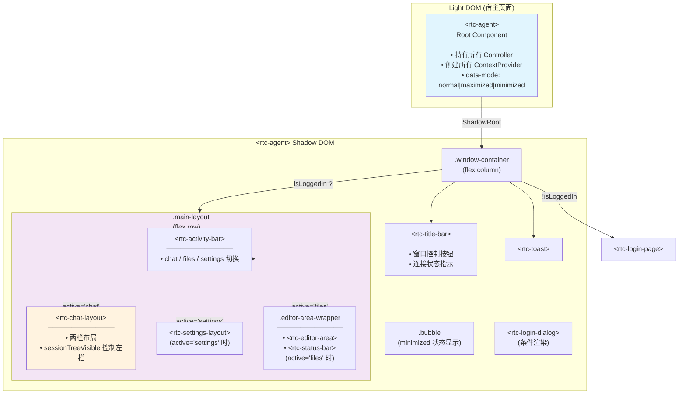
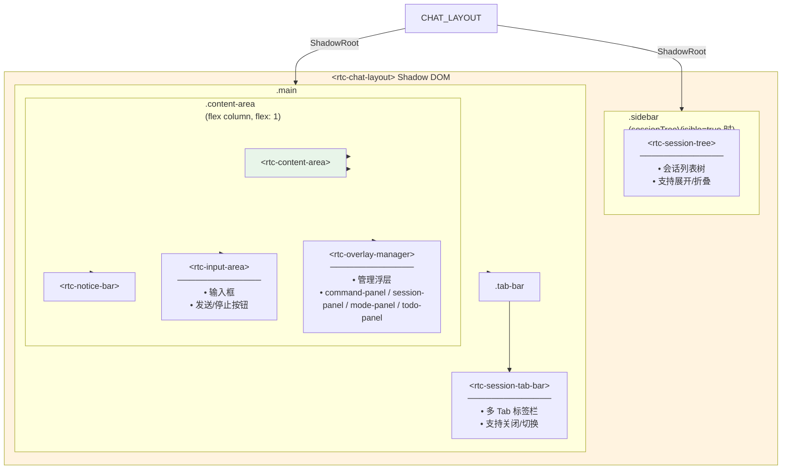
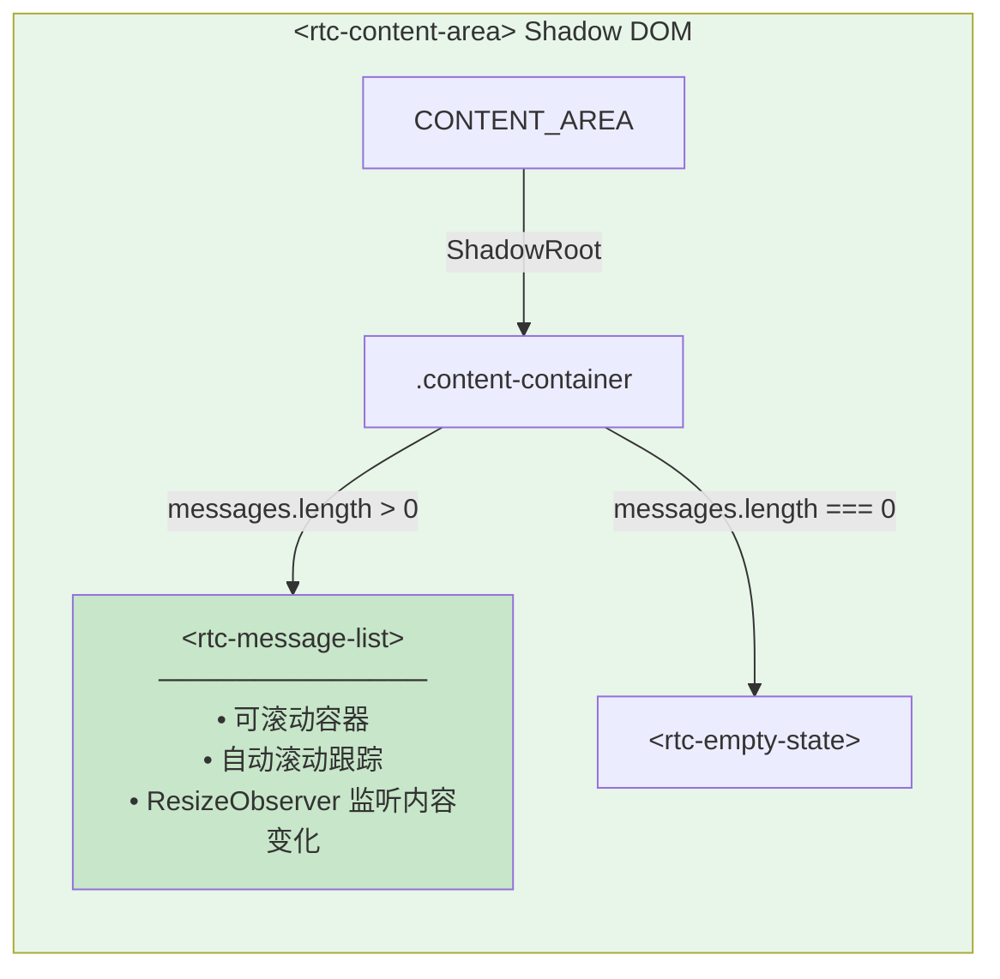
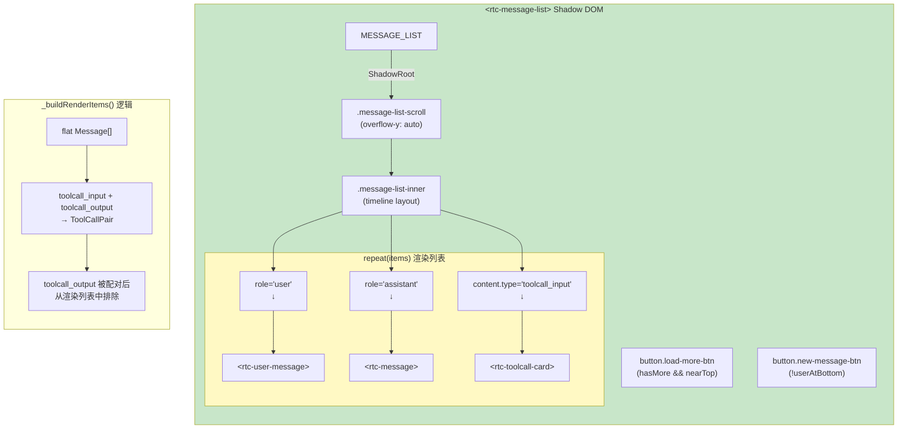
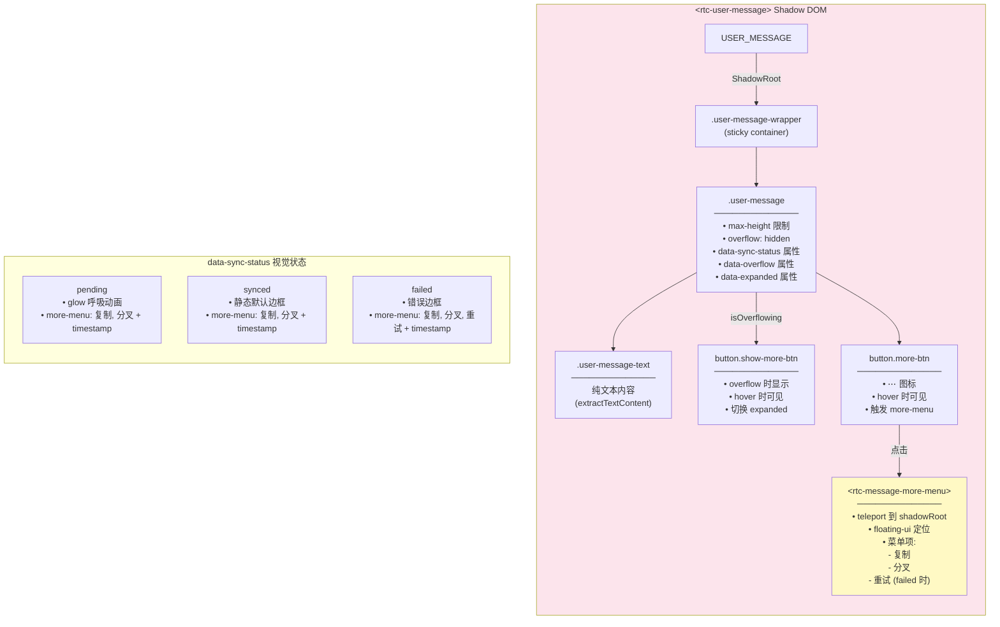
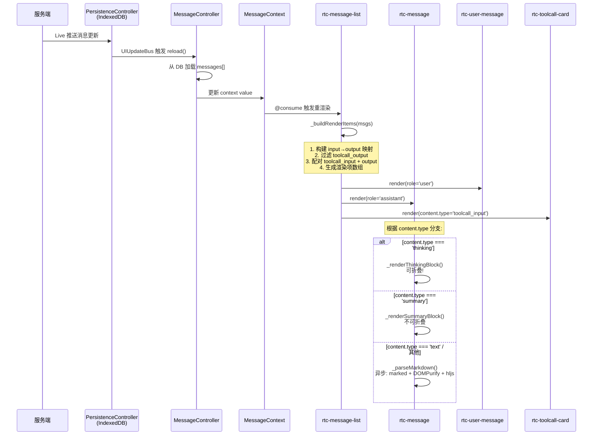
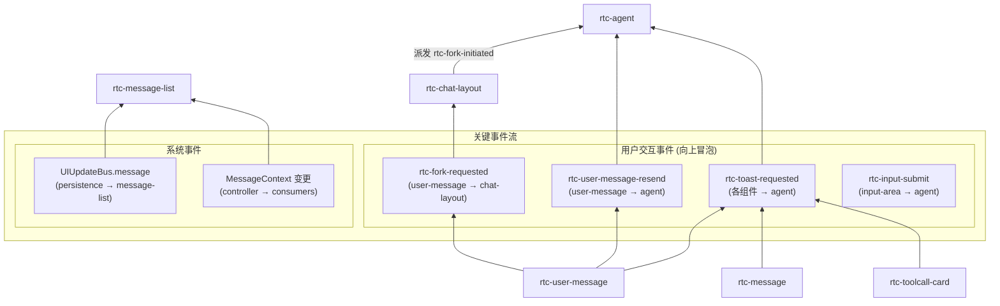

# RTC Message Container Layer 架构

> 从 `<rtc-agent>` 到 `<rtc-message>` 的完整容器关系图，包含 Shadow DOM 边界、可折叠状态、内容类型分支。
> 用于 BUG 排查时理解组件嵌套和数据流向。

## 1. 整体容器层次图



## 2. Chat Layout 内部结构



## 3. Content Area 消息渲染分支



## 4. Message List 内部渲染逻辑（关键）



## 5. rtc-message 内部结构（内容类型分支）

```mermaid
graph TD
    subgraph MESSAGE_SHADOW["&lt;rtc-message&gt; Shadow DOM"]
        direction TB

        TIMELINE_ITEM[".timeline-item<br/>──────────────<br/>CSS Classes:<br/>• streaming (流式中)<br/>• thinking-content (思考类型)<br/>• summary-content (压缩摘要)<br/>• success (完成状态)"]

        MESSAGE -->|"ShadowRoot"| TIMELINE_ITEM

        DOT[".timeline-dot<br/>──────────────<br/>• 时间线圆点<br/>• data-timestamp 属性<br/>• 点击复制内容"]

        CONTENT[".timeline-content"]

        TIMELINE_ITEM --> DOT
        TIMELINE_ITEM --> CONTENT

        CONTENT -->|"content.type === 'thinking'"| THINKING_BLOCK
        CONTENT -->|"content.type === 'summary'"| SUMMARY_BLOCK
        CONTENT -->|"其他类型 (text, markdown 等)"| MARKDOWN_WRAPPER

        subgraph THINKING_BLOCK[".thinking-block<br/>──────────────<br/>⚡ 可折叠!<br/>data-expanded 属性控制"]
            direction TB
            THINKING_HEADER[".thinking-header<br/>──────────────<br/>• 点击切换折叠<br/>• ▸ / ▾ 箭头<br/>• '思考过程' 标签"]
            THINKING_BODY[".thinking-body<br/>(expanded 时渲染)"]
            THINKING_MARKDOWN["div.innerHTML<br/>(Markdown 渲染)"]

            THINKING_BLOCK --> THINKING_HEADER
            THINKING_BLOCK -->|"expanded=true"| THINKING_BODY
            THINKING_BODY --> THINKING_MARKDOWN
        end

        subgraph SUMMARY_BLOCK[".summary-block<br/>──────────────<br/>❌ 不可折叠"]
            direction TB
            SUMMARY_HEADER[".summary-header"]
            SUMMARY_LABEL["span.summary-label<br/>──────────────<br/>• streaming: '正在压缩上下文...'<br/>• 完成: '已压缩上下文'"]
            SUMMARY_STATS["span.summary-stats<br/>──────────────<br/>• 释放/增加 X token<br/>• 耗时 X ms"]

            SUMMARY_BLOCK --> SUMMARY_HEADER
            SUMMARY_HEADER --> SUMMARY_LABEL
            SUMMARY_HEADER --> SUMMARY_STATS
        end

        subgraph MARKDOWN_WRAPPER["div (Markdown 包裹层)<br/>──────────────<br/>❌ 不可折叠"]
            direction TB
            INNER_HTML["div.innerHTML<br/>──────────────<br/>• marked.parse() 解析<br/>• DOMPurify.sanitize() 净化<br/>• hljs 代码高亮"]
            RENDERED_P["&lt;p&gt;/&lt;h1&gt;/&lt;pre&gt;..."]

            MARKDOWN_WRAPPER --> INNER_HTML
            INNER_HTML --> RENDERED_P
        end
    end

    style MESSAGE_SHADOW fill:#e3f2fd
    style THINKING_BLOCK fill:#fff9c4
    style SUMMARY_BLOCK fill:#f3e5f5
    style MARKDOWN_WRAPPER fill:#e8f5e9
```

## 6. rtc-user-message 内部结构



## 7. rtc-toolcall-card 内部结构

```mermaid
graph TD
    subgraph TOOLCALL_SHADOW["&lt;rtc-toolcall-card&gt; Shadow DOM"]
        direction TB

        TIMELINE_ITEM[".timeline-item.toolcall-card-item<br/>──────────────<br/>• data-toolcall-status 属性<br/>  - running: 橙色脉冲<br/>  - done: 绿色静态"]

        TOOLCALL -->|"ShadowRoot"| TIMELINE_ITEM

        DOT[".timeline-dot"]
        CONTENT[".timeline-content"]

        TIMELINE_ITEM --> DOT
        TIMELINE_ITEM --> CONTENT

        subgraph CARD[".toolcall-card"]
            direction TB

            HEADER[".toolcall-header<br/>──────────────<br/>span.toolcall-name<br/>(tool_name)"]

            subgraph SECTION_IN[".toolcall-section.in<br/>──────────────<br/>输入参数区域"]
                LABEL_IN["span.toolcall-label<br/>'In'"]
                VALUE_IN["span.toolcall-value<br/>(JSON 格式化)"]
                COPY_IN["button.copy-btn<br/>(复制 input)"]
            end

            subgraph SECTION_OUT[".toolcall-section.out<br/>(hasOutput 时渲染)"]
                LABEL_OUT["span.toolcall-label<br/>'Out'"]
                VALUE_OUT[".toolcall-output-content<br/>(JSON 格式化)"]
                COPY_OUT["button.copy-btn<br/>(复制 output)"]
            end

            CARD --> HEADER
            CARD --> SECTION_IN
            CARD -->|"pair.output 存在"| SECTION_OUT
        end

        CONTENT --> CARD
    end

    subgraph PAIR["ToolCallPair 数据模型"]
        direction TB
        INPUT["input: Message<br/>(content.type = 'toolcall_input')"]
        OUTPUT["output?: Message<br/>(content.type = 'toolcall_output')"]
    end

    style TOOLCALL_SHADOW fill:#e0f2f1
    style SECTION_IN fill:#e3f2fd
    style SECTION_OUT fill:#e8f5e9
```

## 8. 完整数据流图：Message 从 Agent 到渲染



## 9. 关键状态属性速查表

| 组件 | 属性/状态 | 说明 | 影响 |
|------|-----------|------|------|
| `rtc-agent` | `data-mode` | `normal` / `maximized` / `minimized` | 窗口视觉状态 |
| `rtc-message` | `.streaming` | 流式传输中 | 圆点动画 |
| `rtc-message` | `.thinking-content` | 思考类型消息 | 渲染折叠块 |
| `rtc-message` | `.summary-content` | 压缩摘要消息 | 渲染摘要块 |
| `rtc-message` | `.success` | 完成状态（最后一条 + 非流式 + 非思考/摘要） | 绿色圆点 |
| `rtc-message` | `_thinkingExpanded` | 思考块展开状态 | 显示/隐藏内容 |
| `rtc-user-message` | `data-sync-status` | `pending` / `synced` / `failed` | 边框动画、菜单项 |
| `rtc-user-message` | `data-overflow` | 文本溢出 | 显示 "Show more" |
| `rtc-user-message` | `data-expanded` | 展开状态 | 取消 max-height 限制 |
| `rtc-toolcall-card` | `data-toolcall-status` | `running` / `done` | 圆点颜色（橙/绿） |

## 10. Shadow DOM 边界汇总

```
<rtc-agent>                          ← 宿主页面 Light DOM
  #shadow-root
    ├── <rtc-title-bar>              ← Shadow DOM
    ├── <rtc-chat-layout>            ← Shadow DOM
    │     #shadow-root
    │       ├── <rtc-session-tree>   ← Shadow DOM (嵌套)
    │       ├── <rtc-session-tab-bar>
    │       └── <rtc-content-area>   ← Shadow DOM (嵌套)
    │             #shadow-root
    │               └── <rtc-message-list>
    │                     #shadow-root
    │                       ├── <rtc-user-message>
    │                       ├── <rtc-message>
    │                       └── <rtc-toolcall-card>
    ├── <rtc-editor-area>
    ├── <rtc-status-bar>
    ├── <rtc-toast>
    └── <rtc-login-dialog>
```

## 11. 事件流向图



## 12. 可折叠组件清单

| 组件 | 折叠目标 | 触发方式 | 默认状态 | 状态属性 |
|------|----------|----------|----------|----------|
| `rtc-message` (thinking) | `.thinking-body` | 点击 `.thinking-header` | 折叠 (`false`) | `_thinkingExpanded` |
| `rtc-user-message` | 文本高度 | 点击 `.show-more-btn` | 折叠 (max-height) | `_expanded` / `data-expanded` |
| `rtc-session-tree-item` | 子节点列表 | 点击展开图标 | 折叠 | controller state |

## 13. 内容类型映射表

| `message.content.type` | 渲染组件 | 渲染方式 | 可折叠 |
|------------------------|----------|----------|--------|
| `text` | `rtc-message` | Markdown → HTML | ❌ |
| `thinking` | `rtc-message` | Markdown → HTML (折叠块) | ✅ |
| `summary` | `rtc-message` | 统计信息块 | ❌ |
| `toolcall_input` | `rtc-toolcall-card` | 配对渲染 In/Out | ❌ (卡片整体) |
| `toolcall_output` | (不直接渲染) | 被配对到 input | N/A |

---

## BUG 排查提示

1. **消息不显示**：检查 `MessageContext` 是否正确传递，`rtc-message-list` 是否收到 `_ctx` 更新
2. **Markdown 渲染异常**：检查 `_parseGeneration` 守卫是否丢弃了过期结果，DOMPurify 是否净化了预期内容
3. **思考块不折叠/展开**：检查 `_thinkingExpanded` 状态，`data-expanded` 属性是否正确反映
4. **ToolCall 不配对**：检查 `parentClientId` 是否正确设置，`inputToOutput` Map 是否匹配成功
5. **滚动不跟随**：检查 `_shouldAutoScroll` 状态，`ResizeObserver` 是否正常触发
6. **用户消息溢出按钮不显示**：检查 `_resizeObserver` 是否监听 `_textEl`，`data-overflow` 属性是否设置
